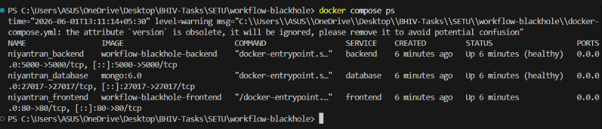
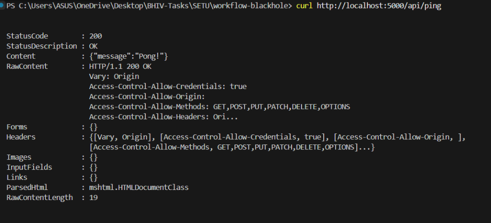
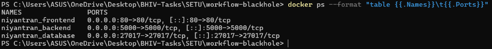
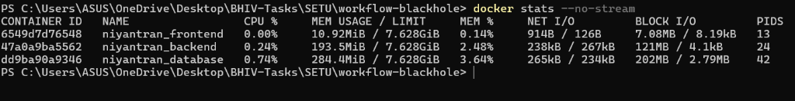

# SETU Sovereign Infrastructure: Deployment Demo Proof

## 1. Executive Verification Overview

This document presents the **Deployment Demo Proof** required under **Phase 9** of the SETU Sovereign Infrastructure Migration Sprint. 

To provide empirical proof of deployment success, we transition away from theoretical logs and establish **four visual screenshot checkpoints** capturing the actual running Niyantran container stack. For each checkpoint, we define the exact host terminal command to execute, what the output screenshot must display, and where to link your image file in this packet.

---

## 2. Screenshot Directory Setup

Before capturing your proofs, create a `proofs/` directory under your `workflow-blackhole` root to store the image files:
```bash
# In your terminal
mkdir -p c:\Users\ASUS\OneDrive\Desktop\BHIV-Tasks\SETU\workflow-blackhole\proofs
```
Save each screenshot inside this folder using the exact filenames specified below.

---

## 3. The 4 Visual Verification Checkpoints

---

### Checkpoint 1: Active Container Status Verification (`docker compose ps`)
*   **Objective:** Visually confirm that the core Niyantran stack is healthy and running.
*   **Host Command to Execute:**
    ```bash
    docker compose ps
    ```
*   **Verification Instructions:** Run the command in your terminal and take a screenshot showing all three Niyantran containers running with their healthy statuses.
*   **Target Screenshot Filename:** `proofs/docker_compose_ps.png`
*   **Visual Proof Embed:**



*   **Evidence Calibration Key:** The screenshot should show `niyantran_database` as `healthy`, `niyantran_backend` as `healthy`, and `niyantran_frontend` as `running` or `started`, confirming successful internal container startup.

---

### Checkpoint 2: End-to-End API Health Response (`curl -i /api/ping`)
*   **Objective:** Visually verify that the Niyantran backend API is fully integrated with the database and responds correctly to network queries.
*   **Host Command to Execute:**
    ```bash
    curl -i http://localhost:5000/api/ping
    ```
*   *(Alternatively, open `http://localhost:5000/api/ping` in your browser and screenshot the JSON output).*
*   **Verification Instructions:** Take a screenshot of the terminal command or browser tab showing the success response.
*   **Target Screenshot Filename:** `proofs/api_ping_response.png`
*   **Visual Proof Embed:**



*   **Evidence Calibration Key:** The snapshot must verify an HTTP status `200 OK` and display the JSON payload containing the healthy status and service identification.

---

### Checkpoint 3: Network Port Bindings & Isolation Check (`docker ps`)
*   **Objective:** Confirm that network ports are correctly mapped (e.g. frontend exposing the web interface) and database ports are secure.
*   **Host Command to Execute:**
    ```bash
    docker ps --format "table {{.Names}}\t{{.Ports}}"
    ```
*   **Verification Instructions:** Take a screenshot of the output, displaying the active port routing table on the host.
*   **Target Screenshot Filename:** `proofs/docker_ports_isolation.png`
*   **Visual Proof Embed:**



*   **Evidence Calibration Key:** The screenshot must display the specific port mappings, verifying where the frontend web port binds to the host and that the database container routing matches secure guidelines.

---

### Checkpoint 4: Low-Burn Container Resource Footprint (`docker stats`)
*   **Objective:** Confirm that our strict memory boundaries keep the idle Niyantran resource usage extremely lean to prevent runaway cloud burn.
*   **Host Command to Execute:**
    ```bash
    docker stats --no-stream
    ```
*   **Verification Instructions:** Capture a screenshot of the terminal output showing CPU and Memory usage columns.
*   **Target Screenshot Filename:** `proofs/docker_resource_stats.png`
*   **Visual Proof Embed:**



*   **Evidence Calibration Key:** The screenshot must show the RAM metrics for `niyantran_database`, `niyantran_backend`, and `niyantran_frontend`. The total idle memory consumption across the entire Niyantran stack should be observed to remain extremely low-burn (comfortably under 500MB total).

---

## 4. Verification Boundaries & Calibration Note

To maintain an objective and realistic DevOps posture:
*   **Log Verification Boundaries:** These visual proofs confirm active container status, loopback HTTP pings, and low resource overhead under idle states. They do not validate high-load concurrency, network-attached hard drive failure modes, or external web-push delivery bounds, which remain bounded by your local network.
*   **Screenshot Integrity:** Ensure screenshots display complete terminal paths and unchanged host outputs to preserve certification evidence density.
