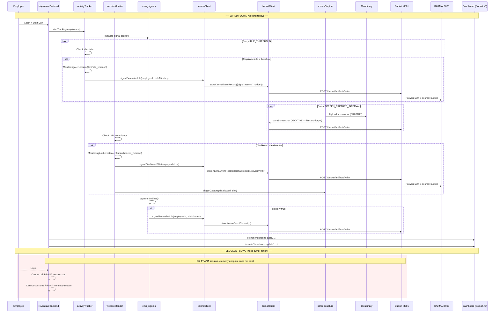

# Event Flow Diagram (As-Built)

## Fire-and-Forget Contract

All KARMA signal and Bucket artifact calls from Niyantran are **fire-and-forget**:
- Wrapped in `try/catch` at the `require()` level
- `.catch()` on the promise — only logs a warning
- **Failure never breaks monitoring pipeline** — idle detection, website monitoring, and screenshot capture continue regardless
