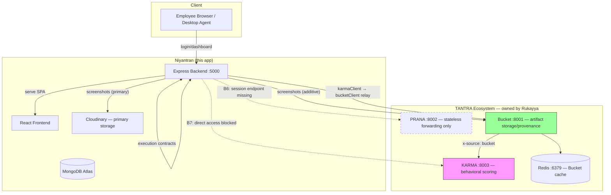

# Integration Diagram (As-Built)

**Legend:**
- Solid lines = wired and working
- Dashed lines = blocked by owner dependencies
- Green = Bucket (fully integrated)
- Pink = KARMA (integrated via Bucket relay, not direct)
