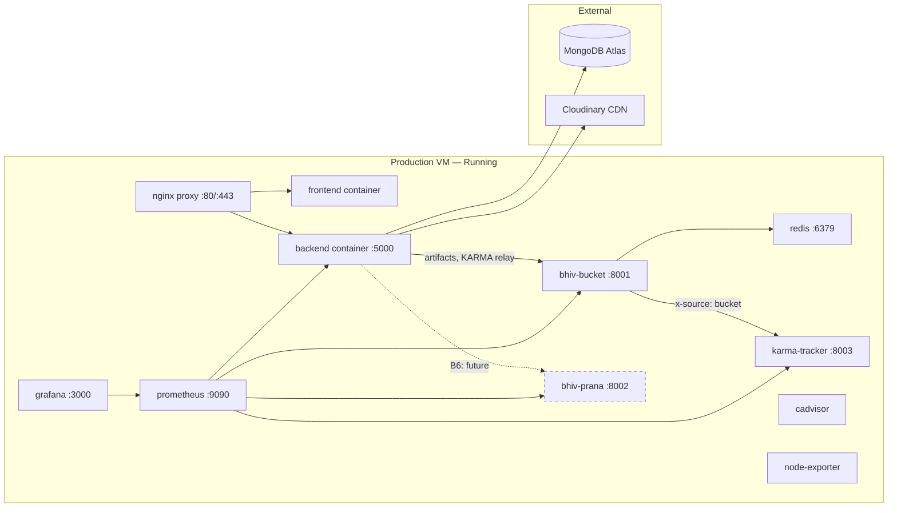

# Runtime Dependency Diagram (As-Built)

## Startup Order (enforced by docker-compose depends_on)

1. **Redis** — no dependencies
2. **bhiv-bucket** — depends on Redis (healthy)
3. **bhiv-prana** — no dependencies (can start in parallel with Bucket)
4. **karma-tracker** — depends on bhiv-bucket (healthy)
5. **backend** — depends on bhiv-bucket (healthy)
6. **frontend** — depends on backend (healthy)
7. **proxy** — depends on frontend + backend
8. **monitoring** — independent (prometheus, grafana, cadvisor, node-exporter)
