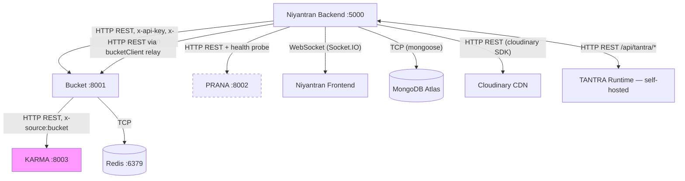

# Service Communication Map (As-Built)

## Communication Details

| From | To | Protocol | Port | Auth | Endpoint Examples |
|------|----|----------|------|------|-------------------|
| Backend | Bucket | HTTP REST | 8001 | `x-api-key` + `x-source: niyantran` | `POST /bucket/artifacts/write`, `POST /governance/gate/validate-operation`, `GET /health` |
| Bucket | KARMA | HTTP REST | 8003 | `x-source: bucket` | `POST /api/v1/log-action/`, `POST /api/v1/karma` |
| Backend | PRANA | HTTP REST | 8002 | `PRANA_API_KEY` (reserved) | `GET /health`, `POST /prana/ingest` (stateless only) |
| Backend | MongoDB | TCP | 27017 | Connection string | `MONGODB_URI` env var |
| Backend | Cloudinary | HTTPS | 443 | SDK credentials | `CLOUDINARY_CLOUD_NAME` + key + secret |
| Backend | Frontend | WebSocket | 5000 | JWT in handshake | Socket.IO namespaces |
| External | TANTRA | HTTP REST | 5000 | `x-execution-key` | `POST /api/tantra/execution/participate`, `GET /api/tantra/health` |
| Admin | Integration | HTTP REST | 5000 | JWT (Admin role) | `GET /api/integration/health` |

## What Niyantran CANNOT Call Directly

| Target | Endpoint | Reason | Workaround |
|--------|----------|--------|-----------|
| KARMA | `/api/v1/log-action/` | `authorization.py` rejects `x-source: niyantran` | Route through `bucketClient.storeKarmaEventRecord()` |
| KARMA | `/api/v1/karma/{user_id}` | Same authorization block | Query via Bucket if/when needed |
| PRANA | `POST /prana/session/start` | Endpoint doesn't exist (B6) | Wait for Rukayya to build it |
