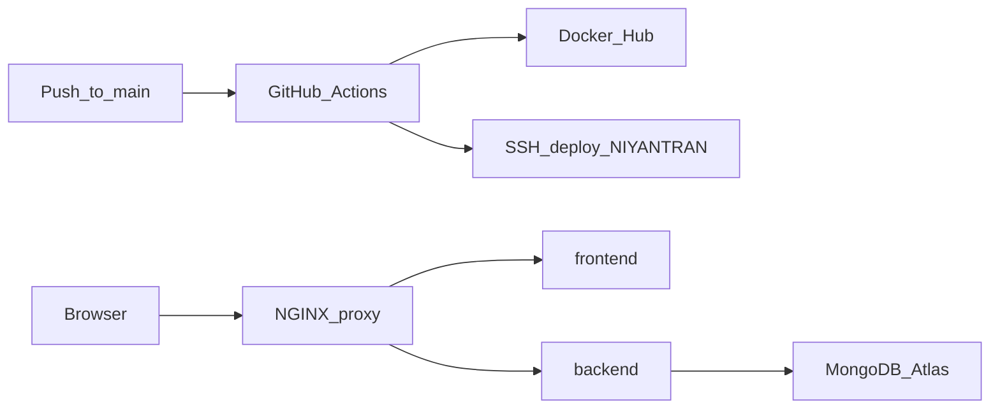

# VM Production Support — REVIEW PACKET

**Product:** Niyantran  
**Task:** Niyantran VM Production Support  
**App ownership:** Shashank  
**Infra execution:** Alay Patel  
**Architecture baseline:** Nikhil handover (Docker + GitHub Actions + NGINX) — preserved  

Operational runbook: [ALAY_RUNBOOK.md](ALAY_RUNBOOK.md)

---

## 1. Architecture overview

| Layer | Implementation |
|-------|----------------|
| Ingress | `proxy` container mounts `proxy configurations/nginx.conf` (`/`, `/api/`, `/socket.io/`) |
| App | `bhiv/niyantran-backend` + `bhiv/niyantran-frontend` images |
| Data | MongoDB Atlas via `MONGODB_URI` (local Mongo service commented out in production template) |
| Observability | Prometheus, Grafana, node-exporter, cAdvisor (ports 9090/3000 host-published) |
| Deploy root | **`~/NIYANTRAN`** (not `/opt/setu/production` — that path remains optional/manual) |

---

## 2. Deployment flow

1. Push to `main` triggers `.github/workflows/cicd.yml`.
2. **validate** — substitute `IMG_TAG`, `docker compose config` with `secrets.MONGODB_URI`.
3. **build** — push backend/frontend images to Docker Hub; frontend `VITE_API_URL` from optional secret or default `http://163.128.209.18/api`.
4. **deploy** — write `.env` from `secrets.ENV_FILE`, SCP to VM `~/NIYANTRAN`, pull/up compose, health-check `/api/ping` + `/`, rollback on failure.

---

## 3. Atlas integration approach and security rationale

| Control | Choice | Rationale |
|---------|--------|-----------|
| Credential store | GitHub Secrets `MONGODB_URI` + same URI inside `ENV_FILE` | Already wired in CI; no second vault; never in git |
| Network | Atlas allowlist **VM egress IP only** | Limits abuse if URI leaks; avoids `0.0.0.0/0` |
| Host file | `~/NIYANTRAN/.env` with `chmod 600` | Matches live CI filename; least local read access |
| DB user | Dedicated Niyantran Atlas user | Least privilege vs shared cluster admin |
| DB name | Must match data path (`blackhole_db` vs `niyantran`) | Wrong name → empty Dept/Branch with “healthy” connect |

App change: backend CORS and Socket.IO origins now include `FRONTEND_URL` / `CORS_ORIGIN` from env (comma-separated), so the VM browser origin works without hardcoding only Vercel/domain hosts.

---

## 4. Deployment / ops screenshots

Place Alay-captured images under [screenshots/](screenshots/) and link them here.

| Evidence | Filename (suggested) | Status |
|----------|----------------------|--------|
| GitHub Actions successful run | `screenshots/01-github-actions.png` | **Pending Alay** |
| `docker compose ps` on VM | `screenshots/02-docker-ps.png` | **Pending Alay** |
| Backend logs Mongo connected | `screenshots/03-mongo-connected.png` | **Pending Alay** |
| VM UFW / listening ports | `screenshots/04-vm-ufw-ports.png` | **Pending Alay** |
| Login success | `screenshots/05-login.png` | **Pending Alay** |
| Departments list populated | `screenshots/06-departments.png` | **Pending Alay** |
| Branches list populated | `screenshots/07-branches.png` | **Pending Alay** |
| Socket.IO connected (DevTools) | `screenshots/08-socketio.png` | **Pending Alay** |

Commands to capture: see Phase 1 and Phase 3 in [ALAY_RUNBOOK.md](ALAY_RUNBOOK.md).

---

## 5. Production validation (checklist)

- [ ] Containers healthy: proxy, frontend, backend  
- [ ] `curl http://localhost/api/ping`  
- [ ] Atlas connect log line present  
- [ ] `checkConnection.js` shows non-zero `departments` / `branches` / `users` (or seed/migrate completed)  
- [ ] Login works from browser origin matching `FRONTEND_URL`  
- [ ] Workflow action executes  
- [ ] Socket.IO over `/socket.io/` without CORS errors  

---

## 6. Failure scenarios tested / to test

| Scenario | Expected | Mitigation |
|----------|----------|------------|
| Bad Atlas password | Backend exit / restart loop | Fix secret; redeploy |
| IP not on Atlas allowlist | Connection timeout | Add VM `/32` |
| Wrong DB name in URI | Connect OK, empty collections | Correct URI path |
| Empty Atlas after cutover | UI shows no Dept/Branch | `mongorestore` or `seedBranches.js` / `seedDepartment.js` |
| CORS origin mismatch | Browser blocks API/Socket | Set `FRONTEND_URL` + `CORS_ORIGIN`; redeploy backend |

---

## 7. Known limitations

1. Default proxy config is **HTTP** (`nginx.conf`); TLS template exists but needs DNS + Certbot.  
2. CI still supports password SSH via `sshpass` until key-based deploy is cut over.  
3. Grafana `:3000` and Prometheus `:9090` are published on the host — restrict via UFW or SSH tunnel.  
4. Socket.IO has no handshake JWT (pre-existing); HTTP APIs use `x-auth-token`.  
5. Screenshot evidence in this packet depends on Alay capturing live VM/GA artifacts.

---

## 8. Next recommended improvements

1. Complete Atlas IP allowlist + secret injection; capture screenshots above.  
2. Migrate CI SSH to deploy keys; then disable password auth.  
3. Enable `nginx.ssl.conf` + domain; update `VITE_API_URL` / CORS to HTTPS.  
4. Close public Grafana/Prometheus or put them behind auth.  
5. Phase 5 enablement of PRANA / Live Monitoring / Attendance per `BHIV_INFRA_READINESS.md` once Atlas + Socket path is stable.

---

## 9. Phase 5 — Future-ready note

VM resources + persistent Socket.IO via NGINX + Atlas remove Render/Vercel cold-start and WebSocket limits that previously constrained PRANA, Live Monitoring, and Live Attendance. This packet does **not** turn those products on; it confirms the infrastructure path is ready for that next enablement without rewriting the Niyantran compose architecture.

---

## 10. CODE_PACKET index

See [CODE_PACKET/README.md](CODE_PACKET/README.md) for every file changed in this task and why.
