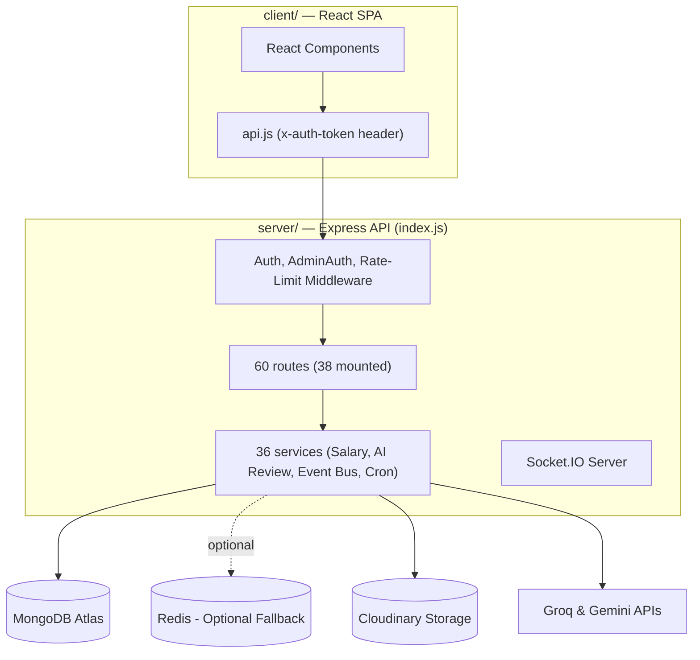

# Handover Review Packet — Niyantran (workflow-blackhole)

**Repository Root:** `workflow-blackhole/`  
**System Owner:** Shashank Mishra  
**Target Reviewers / Successors:** Vijay Dhawan, Isha Singh, Soham Kotkar  
**Ecosystem Acceptance Authority:** Rishabh Yadav  

---

## 1. System Overview & Core Architecture

Per `ECOSYSTEM_REPOSITORY_MAP.md`, this repository contains the **Niyantran** (workflow executor) stack, also referred to as Complete-Infiverse. It manages tasking, payroll, telemetry, AI-assisted reviews, and attendance.

The architecture is centered around a single Node.js Express process acting as the primary hub, communicating with a React SPA client and a MongoDB Atlas database:



*   **`client/` (React/Vite):** Frontend interface configured via Vite build-time environment variables.
*   **`server/` (Express):** Exposes 311 active endpoints. Uses custom `x-auth-token` headers for authentication.
*   **Redis Event Bus:** Built with local in-memory fallback routing in case Redis is offline.

---

## 2. Onboarding Flow (Suggested Review Order)

Follow this step-by-step sequence to review the Niyantran codebase and its configurations:

```
[00_HANDOVER_PLAN.md] ──► [01_EXECUTIVE_OVERVIEW.md] ──► [02_ARCHITECTURE_GUIDE.md]
                                                                  │
  ┌───────────────────────────────────────────────────────────────┘
  ▼
[03_SOURCE_WALKTHROUGH.md] ──► [05_DATABASE_GUIDE.md] ──► [04_DEPLOY_GUIDE / 08_RUNBOOK]
                                                                  │
  ┌───────────────────────────────────────────────────────────────┘
  ▼
[07_KNOWN_ISSUES_REGISTER.md] ──► [13_EVIDENCE_PACKET.md] ──► [14_EXECUTIVE_ASSESSMENT.md]
```

1.  **Start here:** Read [handover/00_HANDOVER_PLAN.md](file:///c:/Users/shash/OneDrive/Documents/New folder/workflow-blackhole/handover/00_HANDOVER_PLAN.md) for deliverables checklist and local setup verification.
2.  **Executive Overview:** Read [handover/01_EXECUTIVE_OVERVIEW.md](file:///c:/Users/shash/OneDrive/Documents/New folder/workflow-blackhole/handover/01_EXECUTIVE_OVERVIEW.md) to understand maturity status and limitations.
3.  **Architecture:** Review [handover/02_ARCHITECTURE_GUIDE.md](file:///c:/Users/shash/OneDrive/Documents/New folder/workflow-blackhole/handover/02_ARCHITECTURE_GUIDE.md) to study routing middleware, socket connections, and Redis event bus logic.
4.  **Source Code Walkthrough:** Refer to [handover/03_SOURCE_CODE_WALKTHROUGH.md](file:///c:/Users/shash/OneDrive/Documents/New folder/workflow-blackhole/handover/03_SOURCE_CODE_WALKTHROUGH.md) to parse folder allocations and see which routes are active.
5.  **Database Collections:** Review [handover/05_DATABASE_GUIDE.md](file:///c:/Users/shash/OneDrive/Documents/New folder/workflow-blackhole/handover/05_DATABASE_GUIDE.md) mapping all 43 collections, duplicate models, and Mongoose relations.
6.  **Deployments & Operations:** Study [handover/04_DEPLOYMENT_GUIDE.md](file:///c:/Users/shash/OneDrive/Documents/New folder/workflow-blackhole/handover/04_DEPLOYMENT_GUIDE.md) (Docker setup, NGINX SSL config, CI/CD pipeline) and [handover/08_OPERATIONS_RUNBOOK.md](file:///c:/Users/shash/OneDrive/Documents/New folder/workflow-blackhole/handover/08_OPERATIONS_RUNBOOK.md) (monitoring, automated rollback).
7.  **Bugs & Vulnerabilities:** Check [handover/07_KNOWN_ISSUES_REGISTER.md](file:///c:/Users/shash/OneDrive/Documents/New folder/workflow-blackhole/handover/07_KNOWN_ISSUES_REGISTER.md) containing the 19 verified issues.
8.  **Evidence Pack:** Read [handover/13_EVIDENCE_PACKET.md](file:///c:/Users/shash/OneDrive/Documents/New folder/workflow-blackhole/handover/13_EVIDENCE_PACKET.md) to review testing commands, Jest runtimes, and local execution logs.
9.  **Executive Assessment:** Review [handover/14_EXECUTIVE_ASSESSMENT.md](file:///c:/Users/shash/OneDrive/Documents/New folder/workflow-blackhole/handover/14_EXECUTIVE_ASSESSMENT.md) for risks and recommendations.

---

## 3. Core Runtime & API Summary

*   **Express Backend Default Port:** `5000` (or `PORT` env variable)
*   **Authentication Header:** `x-auth-token: <jwt>` (JWT expires in `180d`)
*   **API Documentation:** Full listing of all 311 live routes grouped by Express router in [handover/06_API_DOCUMENTATION.md](file:///c:/Users/shash/OneDrive/Documents/New folder/workflow-blackhole/handover/06_API_DOCUMENTATION.md)
*   **Dependency Map:** See [handover/09_DEPENDENCY_MAP.md](file:///c:/Users/shash/OneDrive/Documents/New folder/workflow-blackhole/handover/09_DEPENDENCY_MAP.md) detailing external services (Cloudinary, Groq, Gemini, SMTP) and cross-repo dependencies (Bucket, Karma, PRANA).

---

## 4. Key Verification Findings & Critical Blockers

The following items are security and operational blockers and must be fixed:

1.  **Plaintext Password Storage (Severity: 🔴 Critical):** User passwords are saved and compared in plain text on login (`password !== user.password`). This requires database hashing migrations using `bcrypt`.
2.  **Hardcoded JWT Secret Fallbacks (Severity: 🟠 High):** Five separate live call sites in `routes/auth.js` fall back to the insecure string `"jwtSecret"` if `JWT_SECRET` is missing.
3.  **Undocumented Environment Variables (Severity: 🟠 High):** `.env.example` templates only list 20 out of ~65 environment variables read by the Express server. Startup required parameters like `TANTRA_EXECUTION_KEY` are undocumented.
4.  **Native Binary Mismatch (Severity: 🟠 High):** Pre-shipped `node_modules/` includes a native binary (`canvas.node`) built for macOS/Darwin, which crashes on Windows/Linux WSL (`invalid ELF header`). Reinstalling dependencies fresh (`npm install`) resolves the error.
5.  **Broken Dev Docker Containers (Severity: 🟡 Medium):** Local `docker-compose.yml` references non-existent Dockerfiles for `bhiv-bucket` and `bhiv_prana`, failing compose builds.
6.  **Orphaned Express Router Files (Severity: 🟡 Medium):** 22 out of 60 router files in `server/routes/` are dead code. One file (`biometricAttendanceFixed.js`) contains a compile-blocking syntax error (`const debugger = ...` using the JS reserved keyword `debugger`).

---

## 5. Reviewer Sign-off Checklist

This checklist must be signed off by successors and the product owner to verify completion:

| Task / Verify Item | Status | Verified By | Date | Comments |
| :--- | :---: | :--- | :--- | :--- |
| Express server runs locally | [ ] | | | Requires fresh `npm install` |
| Jest test suite passes | [ ] | | | 98/98 tests passed |
| Frontend builds successfully | [ ] | | | Checked via `npm run build` |
| Startup environment check fails safely | [ ] | | | Aborts boot if required vars are missing |
| Plaintext password hashing implemented | [ ] | | | Implement `bcrypt` hashing |
| Unused dead routes removed/archived | [ ] | | | Archive 22 orphaned files |
| Dev `docker-compose` building cleanly | [ ] | | | Fix bucket/prana Dockerfiles |
| Demonstration Video recorded | [ ] | | | Plan outlined in `00_HANDOVER_PLAN.md` |
| Production Evidence Pack compiled | [ ] | | | Add database & live ping screenshots |

---

*This document supersedes all older root-level handover and gap checklists in this repository.*
