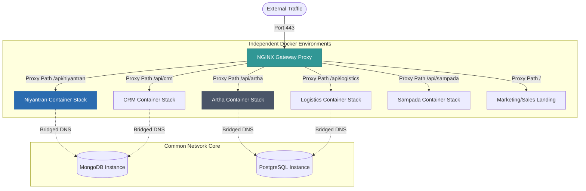

# SETU Sovereign Infrastructure: Modular Deployment Strategy & Rollout Plan

## 1. Architectural Strategy & Decoupling Philosophy

As the **SETU** ecosystem becomes the central operational hub for BHIV, maintaining architectural agility is critical. 

**Core Design Tenet: Avoid Premature Monolithic Coupling.** 
Instead of forcing all six applications and marketing layers into a single giant Docker Compose network immediately—which introduces single-point-of-failure risks and forces shared dependency freezes—the rollout is designed around **Independent Modular Tiers**.

*   **Independent Deployability:** Each container group maintains its own `Dockerfile` and local environment variables. They can be updated, scaled, or rebooted without affecting other microservices.
*   **Decoupled Database Isolation:** Apps share databases via logical boundaries (separate DB schemas within MongoDB or Postgres) rather than sharing actual memory space, allowing future structural migrations.
*   **The Converged Bridge:** Microservices route traffic internally via a shared Docker network bridge (`setu_secure_net`), resolving targets dynamically using internal DNS.

---

## 2. Staged Multi-Service Migration Blueprint

To ensure a stable cutover, services are deployed in a strict dependency sequence:

---

### 1️⃣ Niyantran (Workforce & Employee Monitoring Core)
*   **Role:** The workforce telemetry backbone. Handles high-frequency Socket.IO duplex screenshot and keystroke syncs.
*   **Dependencies:** 
    *   MongoDB database instance.
    *   `VAPID_PRIVATE_KEY` / `VAPID_PUBLIC_KEY` environmental parameters (for push notifications).
    *   System dependencies inside server: `scrot`, `xdotool`, `xvfb`, and `curl` (for health checks).
*   **Migration Steps:**
    1.  Provision the MongoDB container inside the target host.
    2.  Extract the final database archive from Render Cloud (`mongodump --archive=niyantran.archive --gzip`).
    3.  Import the archive directly into the new container (`mongorestore --archive=niyantran.archive --gzip`).
    4.  Expose Express backend port `5000` internally via the secure Docker bridge.
*   **Testing Plan:**
    *   Verify the API container responds with status code `200` on the health check endpoint:
        `curl -f http://niyantran_backend:5000/api/ping`
    *   Verify MongoDB data integrity by checking document counts in the `users` and `attendance` collections via `mongosh`.
*   **Rollback Plan:**
    *   Revert the NGINX upstream route configuration pointing `/api/` to the old Render web service address and reload NGINX (`nginx -s reload`).

---

### 2️⃣ CRM (Customer Relationship Management Monolith)
*   **Role:** Sales, client tracking, and lead database pipeline.
*   **Dependencies:**
    *   MongoDB dataset.
    *   Static React frontend asset bundle built via Vite.
*   **Migration Steps:**
    1.  Import CRM lead data into the MongoDB workspace database in its own logical namespace (`crm_db`).
    2.  Execute static production Vite compile (`npm run build`) in the client directory.
    3.  Copy static HTML/JS/CSS assets to `/usr/share/nginx/html/crm` inside the NGINX container.
*   **Testing Plan:**
    *   Verify that index pages and static chunks return successful status `200` payloads:
        `curl -I http://localhost/crm/index.html`
    *   Validate API lead creation REST requests using test payloads.
*   **Rollback Plan:**
    *   Re-route NGINX proxy endpoints for `/api/crm` to the Render CRM fallback URL.

---

### 3️⃣ Logistics (Supply Chain & Agent Geolocation Tracker)
*   **Role:** Ingestion and real-time mapping of field delivery coordinates.
*   **Dependencies:**
    *   PostgreSQL database (for geographic transactional logging).
    *   Redis cache/broker (for live geospatial queues).
    *   Long-lived WebSocket connections support.
*   **Migration Steps:**
    1.  Spin up the `setu_redis` container with memory limit boundaries (`--maxmemory 256mb --maxmemory-policy allkeys-lru`).
    2.  Import historical logistics tables into PostgreSQL using `psql`.
    3.  Expose the Logistics Python/FastAPI backend container on the internal bridge.
*   **Testing Plan:**
    *   Validate Redis availability by pinging the container:
        `docker exec setu_redis redis-cli ping` (Expected: `PONG`).
    *   Run test coordinates ingestion REST pings and verify data write success in Postgres.
*   **Rollback Plan:**
    *   Switch NGINX location `/api/logistics` back to the secondary active Render service endpoint.

---

### 4️⃣ SETU Unified Layer (API Gateway & Aggregated Dashboard)
*   **Role:** The dashboard gateway that aggregates database and REST responses from CRM, Niyantran, and Logistics.
*   **Dependencies:**
    *   Healthy upstream execution of Niyantran, CRM, and Logistics APIs.
    *   CORS configuration parameters defined on individual backend apps.
*   **Migration Steps:**
    1.  Deploy the React dashboard static assets inside `/usr/share/nginx/html/dashboard`.
    2.  Map NGINX proxy locations to route aggregate queries internally (e.g. `/api/niyantran`, `/api/crm`).
*   **Testing Plan:**
    *   Check for console CORS errors by accessing the dashboard via a browser.
    *   Verify that gateway requests resolve under **150ms** without cascading timeouts.
*   **Rollback Plan:**
    *   Point client-side gateway API variables to the old Vercel/Render aggregate gateway addresses.

---

### 5️⃣ Artha (Financial Billing & Corporate Ledger)
*   **Role:** Billing, ledger calculations, and transaction verification. Highly security-critical.
*   **Dependencies:**
    *   PostgreSQL instance (with high-integrity ACID properties enforced).
    *   Persistent storage disk mounts (requires high-IOPS NVMe blocks to handle write queues).
*   **Migration Steps:**
    1.  Impose a strict database write-lock (Read-Only Mode) on Render Artha.
    2.  Extract the database dump using `pg_dump --clean`.
    3.  Load data into the containerized Postgres database.
    4.  Verify audit balances match the original Render ledger records down to the decimal.
*   **Testing Plan:**
    *   Execute test billing queries on a shadow ledger.
    *   Verify PostgreSQL transaction logs commit without disk latency bottlenecks.
*   **Rollback Plan:**
    *   If balancing checks fail, freeze local Artha and point the DNS/Proxy gateway back to Render's managed PostgreSQL databases.

---

### 6️⃣ Sampada (HR Platform & LangGraph AI Orchestration)
*   **Role:** AI agent pipelines, employee chat history, and LangGraph computations.
*   **Dependencies:**
    *   Heavy Python libraries (LangGraph, langchain, pydantic).
    *   High memory allocation (minimum 2GB container limit to absorb vector processing peaks).
    *   Private OpenAI/Groq API keys.
*   **Migration Steps:**
    1.  Configure the Python environment inside the `server/Dockerfile` using modular buildpacks.
    2.  Verify the environment has access to Groq/OpenAI endpoints using curl.
    3.  Expose port `9000` (Gateway) and `9001` (Orchestrator) internally.
*   **Testing Plan:**
    *   Verify container runtime RAM consumption remains within limits under test chat queries.
    *   Confirm LangGraph transitions execute without timing out.
*   **Rollback Plan:**
    *   Point the AI chat frontend client variable back to the cloud LangGraph service.

---

### 7️⃣ Marketing & Sales (Sovereign Landing Portal)
*   **Role:** Public marketing portal and user capture webhook endpoint.
*   **Dependencies:**
    *   Static HTML/CSS files.
    *   Webhook links to CRM container endpoints.
*   **Migration Steps:**
    1.  Serve static pages on the apex root directory `/` inside the primary NGINX container.
    2.  Map lead acquisition forms to POST straight to the local CRM endpoint `/api/crm/leads`.
*   **Testing Plan:**
    *   Verify that accessing the raw host IP or domain serves the landing page instantly.
    *   Verify that submitting a contact form logs a lead inside MongoDB.
*   **Rollback Plan:**
    *   Point the primary DNS apex routing back to the static website provider (e.g. Netlify/Vercel).

---

## 3. Calibrated Rollout Risks & Fallback Triggers

To maintain a calibrated and honest posture, we must document the explicit risks and numeric thresholds governing this modular rollout:

*   **DNS Propagation Delays (Risk):** During DNS cutover, some regional ISPs ignore low TTL standards and cache old IP addresses for up to 24 hours. Consequently, a small percentage of employee clients may continue routing traffic to Render after cutover.
*   **Fallback Triggers (Abort Metrics):**
    *   **5xx Error Rate:** If the NGINX gateway registers more than **3%** of traffic returning HTTP 5xx errors over a 15-minute window, rollback that specific service's upstream proxy.
    *   **Latency Spike:** If database transactions or REST endpoints average more than **500ms** latency over 15 minutes, revert proxy paths.
    *   **Data Import Mismatches:** If record balance checks in the Artha database fail to match the source ledger, abort and lock the service.
