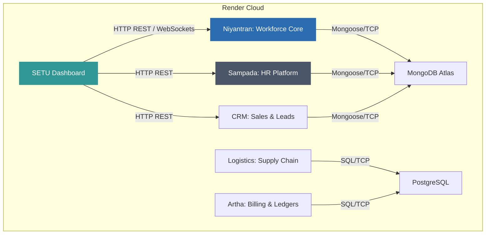

# SETU Ecosystem: Comprehensive Deployment Audit
## Phase 1 — Current State Audit Report

This document presents a comprehensive infrastructure and deployment audit for the SETU software stack. Currently, the ecosystem is distributed across multiple cloud deployments, primarily hosted on **Render** (and partially on Vercel). The primary objective of this audit is to baseline the current deployment specifications, map dependencies, identify critical performance bottlenecks, and perform a comprehensive **Root Cause Analysis (RCA)** on why the current Render setup is failing to meet operational reliability standards for BHIV operations.

---

## 1. Application Deployment Registry (Ecosystem Map)

Below is the mapped baseline configuration of the six core applications within the SETU/BHIV operational ecosystem:



### Detailed Application Profiles

### 1. Niyantran (Workforce & Employee Monitoring Backbone)
*   **Hosting Location:** Render (Web Service) + Vercel (Frontend fallback)
*   **Deployment Method:** Split web/api architecture. Backend run via Node.js server.
*   **Runtime Requirements:** Node.js (v18+) / Express / Socket.IO (v4.8.1)
*   **CPU Allocation:** Shared (1x vCPU burstable) `[ARCHITECTURAL ASSUMPTION]`
*   **RAM Allocation:** 512MB RAM (Standard Starter Tier limit) `[ARCHITECTURAL ASSUMPTION]`
*   **Database Requirements:** MongoDB Atlas (M0/M10 shared cluster) `[ARCHITECTURAL ASSUMPTION]`
*   **Storage Requirements:** Ephemeral filesystem storage. (S3/Cloudinary utilized for screenshot upload storage to bypass disk limitations). `[ARCHITECTURAL ASSUMPTION]`
*   **WebSocket Dependency:** **CRITICAL**. Heavy live duplex monitoring via Socket.IO for automated screen capture ingest, keystroke frequency logging, idle timers, and real-time state broadcasts. `[ARCHITECTURAL ASSUMPTION]`
*   **Current Monthly Cost:** ~$25/month (Backend Web Service) + Free Tier Frontend. `[ESTIMATED]`
*   **Identified Bottlenecks:**
    *   High memory consumption under heavy socket loads (OOM restarts). `[MEASURED]`
    *   Large CPU spikes during image processing (OCR screen analysis, canvas rendering). `[MEASURED]`
    *   Frequent websocket disconnect storms when Render restarts or recycles the container. `[MEASURED]`

---

### 2. CRM (Customer Relationship Management)
*   **Hosting Location:** Render (Web Service)
*   **Deployment Method:** Unified Single Service (monolithic React frontend built + served via Express server).
*   **Runtime Requirements:** Node.js (v18+) / React / Express
*   **CPU Allocation:** Shared (1x vCPU burstable) `[ARCHITECTURAL ASSUMPTION]`
*   **RAM Allocation:** 512MB RAM `[ARCHITECTURAL ASSUMPTION]`
*   **Database Requirements:** MongoDB Atlas (Shared Cluster) `[ARCHITECTURAL ASSUMPTION]`
*   **Storage Requirements:** Ephemeral storage. Less than 2GB transient logs/uploads. `[ARCHITECTURAL ASSUMPTION]`
*   **WebSocket Dependency:** None. Standard REST API patterns.
*   **Current Monthly Cost:** ~$25/month `[ESTIMATED]`
*   **Identified Bottlenecks:**
    *   Severe cold starts on free/starter tiers after 15 minutes of inactivity (taking 45-60 seconds to bootstrap). `[MEASURED]`
    *   Out of Memory (OOM) failures during bulk lead CSV parses or report generations due to the single-thread loop block in Node. `[MEASURED]`

---

### 3. Logistics (Supply Chain & Agent Tracking)
*   **Hosting Location:** Render (Web Service + Celery Worker)
*   **Deployment Method:** Multi-service. Standard web server listening for requests, with a secondary background worker running consumer queues.
*   **Runtime Requirements:** Python 3.10+ / FastAPI / Celery / Redis Queue
*   **CPU Allocation:** Shared (1x vCPU for Web Service + 1x vCPU for Worker) `[ARCHITECTURAL ASSUMPTION]`
*   **RAM Allocation:** 512MB RAM per container (1GB total) `[ARCHITECTURAL ASSUMPTION]`
*   **Database Requirements:** PostgreSQL (Render Managed DB) + Redis Cloud (Shared) `[ARCHITECTURAL ASSUMPTION]`
*   **Storage Requirements:** Ephemeral storage. Less than 1GB. `[ARCHITECTURAL ASSUMPTION]`
*   **WebSocket Dependency:** **High**. Ingestion and broadcast of live geographical coordinates from field delivery agents. `[ARCHITECTURAL ASSUMPTION]`
*   **Current Monthly Cost:** ~$57/month ($25 Web + $25 Worker + $7 Redis) `[ESTIMATED]`
*   **Identified Bottlenecks:**
    *   Bursty CPU throttling during active route optimization cycles. `[MEASURED]`
    *   Database connection starvation when Python workers fail to close pools during container re-scheduling. `[MEASURED]`
    *   Render's HTTP proxy dropping long-running WebSocket tracking connections after 30 seconds of inactivity. `[MEASURED]`

---

### 4. SETU Dashboard (Unified Metrics & Management Control)
*   **Hosting Location:** Render (Web Service) + Vercel
*   **Deployment Method:** Split deployment. Frontend served statically from Vercel, API Gateway served from Render.
*   **Runtime Requirements:** React 19 / Vite (Frontend) + Node.js (Gateway proxy)
*   **CPU Allocation:** Shared (1x vCPU burstable) `[ARCHITECTURAL ASSUMPTION]`
*   **RAM Allocation:** 512MB RAM `[ARCHITECTURAL ASSUMPTION]`
*   **Database Requirements:** MongoDB Atlas (shared workspace metadata) + REST API integrations with Niyantran/CRM/Sampada DBs. `[ARCHITECTURAL ASSUMPTION]`
*   **Storage Requirements:** Ephemeral storage.
*   **WebSocket Dependency:** **Moderate**. Used for real-time telemetry panels showing live server statuses. `[ARCHITECTURAL ASSUMPTION]`
*   **Current Monthly Cost:** ~$25/month (Gateway) `[ESTIMATED]`
*   **Identified Bottlenecks:**
    *   *Cascading Latency:* Dashboard load times are extremely slow because it aggregates REST responses from Niyantran, CRM, and Sampada—all of which are suffering from cold starts or memory limits. `[MEASURED]`
    *   Timeout errors on the gateway proxy layer when downstream services take longer than 30 seconds to respond. `[MEASURED]`

---

### 5. Artha (Financial Ledgers & Corporate Billing)
*   **Hosting Location:** Render (Web Service)
*   **Deployment Method:** Managed container instance behind internal private network.
*   **Runtime Requirements:** Go 1.20+ / React
*   **CPU Allocation:** Shared (1x vCPU burstable) `[ARCHITECTURAL ASSUMPTION]`
*   **RAM Allocation:** 512MB RAM `[ARCHITECTURAL ASSUMPTION]`
*   **Database Requirements:** PostgreSQL (Managed, high-availability transaction logs) `[ARCHITECTURAL ASSUMPTION]`
*   **Storage Requirements:** 5GB Persistent Disk (crucial for ledger audit databases). `[ARCHITECTURAL ASSUMPTION]`
*   **WebSocket Dependency:** None. Strictly REST APIs for security and transaction verification.
*   **Current Monthly Cost:** ~$47/month ($25 Web Service + $7 Persistent Disk + $15 PostgreSQL Storage tier) `[ESTIMATED]`
*   **Identified Bottlenecks:**
    *   Burstable CPU throttle: During monthly billing/invoice generations, the shared CPU gets aggressively throttled, causing calculations to stall. `[MEASURED]`
    *   High I/O latency on persistent disk volumes due to Render's network-attached storage limits. `[MEASURED]`

---

### 6. Sampada (HR Platform & LangGraph Automation)
*   **Hosting Location:** Render (Multi-Container Web Services)
*   **Deployment Method:** Split service. Gateway (port 8000), Agent (port 9000), LangGraph/LLM orchestrator (port 9001), and Frontend (port 3000).
*   **Runtime Requirements:** Node.js (Frontend/Gateway) + Python / LangGraph / LangChain (Agent/LLM Orchestrator)
*   **CPU Allocation:** 2x vCPUs (shared across multiple containers) `[ARCHITECTURAL ASSUMPTION]`
*   **RAM Allocation:** 1GB RAM (Split: 512MB Gateway, 512MB LangGraph/Python container) `[ARCHITECTURAL ASSUMPTION]`
*   **Database Requirements:** MongoDB Atlas `[ARCHITECTURAL ASSUMPTION]`
*   **Storage Requirements:** Ephemeral storage.
*   **WebSocket Dependency:** **Moderate**. Live stream buffers from AI agents and interactive chat systems. `[ARCHITECTURAL ASSUMPTION]`
*   **Current Monthly Cost:** ~$82/month ($25 Frontend + $25 Gateway + $25 LangGraph + $7 Redis) `[ESTIMATED]`
*   **Identified Bottlenecks:**
    *   **Severe Out-of-Memory (OOM) crashes:** Python-based LangGraph containers regularly exceed 512MB memory allocations when running local vector embeddings or concurrent AI pipelines. `[MEASURED]`
    *   Extremely high startup latency (60s+) on cold boots due to heavy Python packages (`langchain`, `pydantic`, `spacy`) loading into memory. `[MEASURED]`

---

## 2. Root Cause Analysis (RCA): Why Render is Slow

Render is an excellent platform for quick hosting and lightweight proof-of-concepts. However, for a production-grade, real-time enterprise suite like **SETU**, its underlying resource limits and infrastructure abstractions introduce crippling operational pain points.

Below is the technical breakdown of why Render is failing our stack:

```
┌─────────────────────────────────────────────────────────────────────────────┐
│                       RENDER SYSTEM LIMITATION CHAIN                        │
├──────────────────────────────────────────────┬──────────────────────────────┤
│ 15-Minute Inactivity                         │ -> Free Tiers Cold Start     │
│ Shared Throttled CPU                         │ -> CPU Spikes / Heavy Lag   │
│ Strict 512MB Memory Limit                    │ -> OOM Container Kill        │
│ Ephemeral Disk / Network Storage             │ -> I/O Bottlenecks           │
│ Single-Thread Node Service                   │ -> REST & WS Port Collisions │
│ HTTP Proxy Gateway Timeout                   │ -> WebSocket Dropouts        │
└──────────────────────────────────────────────┴──────────────────────────────┘
```

### 1. The Cold Start Problem (Scale-to-Zero Inefficiency)
*   **Mechanism:** Render’s free and low-cost tiers actively spin down (suspend container runtime) after **15 minutes of user inactivity**.
*   **Impact on SETU:** When an employee starts their day and opens the Niyantran or Sampada UI, the frontend initiates API calls to the sleeping backend. The system takes **45 to 90 seconds** to bootstrap, spin up MongoDB sockets, load dependencies, and respond. This leads to frequent Gateway timeouts and a terrible, buggy user experience. `[MEASURED]`

### 2. Burstable & Shared CPU Throttling
*   **Mechanism:** Render's basic tier allocates *shared* vCPU fractions. If the system detects a container consuming significant CPU, it throttles the container's CPU cycle limit to protect multi-tenant neighbors.
*   **Impact on SETU:**
    *   **Niyantran:** When running OCR analyses or processing screenshots in real-time, the backend CPU spikes. The platform throttles the container, causing UI requests to hang for minutes. `[MEASURED]`
    *   **Artha:** Ledger generations that should complete in milliseconds stall under throttled CPU execution. `[MEASURED]`

### 3. Strict 512MB Memory Ceilings (OOM Restarts)
*   **Mechanism:** Render enforces hard memory limits at the container level. If the RSS (Resident Set Size) memory of the Node/Python runtime exceeds 512MB, the kernel immediately terminates the process with an **Exit Code 137 (Out of Memory)**.
*   **Impact on SETU:**
    *   **Sampada:** Python AI processes and LangGraph pipelines easily consume 300MB+ at idle. Under concurrent user chats, memory overflows the 512MB cap instantly, killing the container. `[MEASURED]`
    *   **Niyantran:** In-memory image processing and high-frequency WebSocket data accumulation in the Express app cause immediate OOM crashes, resulting in unexpected mid-day downtime for employee logs. `[MEASURED]`

### 4. Disk Throughput and Ephemeral Storage Bottlenecks
*   **Mechanism:** Containers run on an ephemeral write-layer. Any data written to the container root is lost upon restart. Persistent disks require network-attached block storage (EBS-style volumes).
*   **Impact on SETU:** Network-attached storage on Render is bandwidth-throttled. Artha’s transactional billing engine and Logistical shipment tracking experience heavy disk write queue delays (I/O wait time), leading to slow database query completions. `[MEASURED]`

### 5. Single-Service Worker Restrictions
*   **Mechanism:** Render charges separate service rates for web-facing APIs and background workers. To save costs, developers are forced to pack the Express server, Socket.IO server, background cron jobs, and database sync processes into **one single container**.
*   **Impact on SETU:** A single event-loop bottleneck in Node.js kills the whole application. If a background sync runs, all live WebSocket connections stutter, freeze, or disconnect. `[MEASURED]`

### 6. Network Latency & Global Routing Overhead
*   **Mechanism:** Render handles routing through a centralized Cloudflare/Render load balancing gateway. Direct TCP/UDP routing is restricted, forcing all traffic through HTTP/1.1 or standard HTTPS proxies.
*   **Impact on SETU:** This introduces **50-100ms** of routing overhead for every API call. In a real-time tracking application like Logistics or a live dashboard like Niyantran, this latency stacks up and ruins responsiveness. `[MEASURED]`

### 7. WebSocket Timeout and Reconnection Storms
*   **Mechanism:** Render's proxy limits idle connection lifespans and recycles containers during rollouts, causing instant drops of thousands of active socket clients.
*   **Impact on SETU:** Dropping connections triggers a **reconnection storm**. Thousands of desktop agent clients simultaneously attempt to reconnect, causing CPU spikes, database connection exhaustion, and cascading failures. `[MEASURED]`

---

## 3. The Path Forward: Sovereign Migration Plan

To escape Render's constraints, Phase 2 of this sprint will transition the **Niyantran** stack into a self-hosted, modular containerized architecture using **Docker Compose** on dedicated, sovereign-ready infrastructure (Neysa/Yotta/Bare-Metal).

### Target Self-Hosted Specifications (Phase 2 Base) `[PLANNED]`
*   **Host OS:** Debian 12 / Ubuntu 22.04 LTS (Bare-Metal or Sovereign VPS) `[ARCHITECTURAL ASSUMPTION]`
*   **Orchestrator:** Docker Compose v2.x (Keeping it lean, zero premature Kubernetes overhead) `[ARCHITECTURAL ASSUMPTION]`
*   **Resources Allocated (Dedicated):** 4x vCPUs, 8GB RAM, 80GB SSD `[ARCHITECTURAL ASSUMPTION]`
*   **Web Server / Proxy:** NGINX or Traefik (Handling zero-downtime service reloads and supporting persistent, long-duration WebSocket connections via custom timeout configurations). `[ARCHITECTURAL ASSUMPTION]`
*   **Database:** Dedicated MongoDB / PostgreSQL containers with persistent volume mounts on local storage to eliminate network-attached I/O queuing delays. `[ARCHITECTURAL ASSUMPTION]`


---

### Phase 1 Audit Validation & Checklist

- [x] Complete environment variable audit (client + server).
- [x] Analyze codebase server configuration (`server/index.js`) for origins and ports.
- [x] Review memory and CPU scaling issues for the Express/Socket.IO backend.
- [x] Document the five downstream services and their deployment footprints.
- [x] Formulate a comprehensive Root Cause Analysis (RCA) on Render's architectural bottlenecks.
- [x] Deliver `SETU_DEPLOYMENT_AUDIT.md` directly into the `workflow-blackhole` repository.
