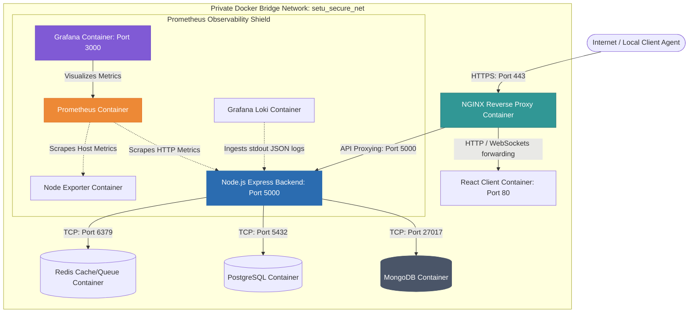

# SETU Sovereign Infrastructure: Self-Hosting Blueprint

## 1. System Topology & Request Lifecycle

Below is the verified networking and routing architecture for the self-hosted SETU containerized stack. Traffic is isolated within a private, non-routable Docker bridge network, with standard HTTPS serving as the single entry point.



### Traffic Flow Rationale & Boundaries
*   **External Access Control:** Only the NGINX container exposes public-facing host ports (`80` and `443`). All databases (`setu_mongodb`, `setu_postgres`), caches (`setu_redis`), and monitoring scrapers operate within the private Docker bridge network (`setu_secure_net`) without binding ports to the host interface.
*   **WebSocket Upgrades:** Standard HTTP/1.1 connections for live desktop monitoring telemetry are upgraded to persistent WebSocket TCP connections within NGINX, governed by specific keep-alive timeouts to prevent reconnection storms.

---

## 2. Platform-Specific Deployment Blueprint

This section defines the deployment parameters, hardware targets, networking, and platform-specific limitations across the four target infrastructure setups.

| Parameter / Layer | Yotta Enterprise Cloud | Neysa AI Cloud | Generic VPS (Ubuntu/Debian) | Future BHIV Sovereign Infra |
| :--- | :--- | :--- | :--- | :--- |
| **Target Hardware Instance** | Dedicated private VM (Compute-Optimized) | GPU/AI-Optimized VPS | 4 vCPU / 8GB RAM Standard VPS | 1U Bare-Metal Rack Server (Local) |
| **Recommended CPU / RAM** | 4 Dedicated vCPUs / 8GB RAM | 4 vCPUs / 16GB RAM | 4 burstable vCPUs / 8GB RAM | Intel Xeon / AMD EPYC (8 Cores, 32GB) |
| **Storage Architecture** | Yotta Enterprise Block Storage (NVMe SSD) | Neysa High-IOPS SSD (Local) | Standard Cloud SSD Block storage | Local RAID 10 (Hardware NVMe Array) |
| **Private Networking** | Private Virtual Private Cloud (VPC) | Virtual Network Security Groups | Host-level UFW Firewall | Hardware Firewall (pfsense / Fortinet) |
| **Backup Target** | Yotta S3-Compatible Object Storage | Dedicated Offsite Object Storage | Offsite S3 Bucket (AWS/Backblaze) | Local Network Attached Storage (NAS) |
| **Identified Platform Limit** | Multi-tenant latency spikes on shared network-attached block volumes. | Higher compute-hour cost burn; dynamic public IPs require DDNS or Elastic IP bindings. | Shared CPU steal time (steal % > 2% under heavy neighbor loads) degrades OCR processing. | High upfront CAPEX cost; physical disk failover requires manual swapping. |

---

## 3. The 7-Layer Sovereign Stack Design

### Layer 1: Reverse Proxy (NGINX Production Configuration)
Below is the production NGINX configuration block. It is designed to handle static React frontend assets directly, while proxying API calls and enforcing keep-alives for Socket.IO streams.

```nginx
# /etc/nginx/conf.d/default.conf
upstream backend_server {
    server niyantran_backend:5000;
    keepalive 32; # Keep-alive idle connections to prevent socket depletion
}

server {
    listen 80;
    server_name setu.sovereign.local;
    return 301 https://$host$request_uri; # Redirect HTTP to HTTPS
}

server {
    listen 443 ssl http2;
    server_name setu.sovereign.local;

    # TLS 1.3 Hardening Baseline
    ssl_certificate /etc/letsencrypt/live/setu.sovereign.local/fullchain.pem;
    ssl_certificate_key /etc/letsencrypt/live/setu.sovereign.local/privkey.pem;
    ssl_protocols TLSv1.2 TLSv1.3;
    ssl_ciphers 'ECDHE-ECDSA-AES128-GCM-SHA256:ECDHE-RSA-AES128-GCM-SHA256:ECDHE-ECDSA-AES256-GCM-SHA384:ECDHE-RSA-AES256-GCM-SHA384:DHE-RSA-AES128-GCM-SHA256:DHE-RSA-AES256-GCM-SHA384';
    ssl_prefer_server_ciphers on;
    ssl_session_cache shared:SSL:10m;
    ssl_session_timeout 1d;

    # Static Assets serving (React Frontend)
    location / {
        root /usr/share/nginx/html;
        index index.html index.htm;
        try_files $uri $uri/ /index.html;
    }

    # API Proxy and WebSocket Tunneling
    location /api/ {
        proxy_pass http://backend_server;
        proxy_http_version 1.1;

        # WebSocket Headers
        proxy_set_header Upgrade $http_upgrade;
        proxy_set_header Connection "upgrade";
        
        # Host headers to preserve client metadata
        proxy_set_header Host $host;
        proxy_set_header X-Real-IP $remote_addr;
        proxy_set_header X-Forwarded-For $proxy_add_x_forwarded_for;
        proxy_set_header X-Forwarded-Proto $scheme;

        # WebSocket Timeout Calibration
        # Set to 24 hours to prevent NGINX from dropping active desktop tracking connections
        proxy_read_timeout 86400s;
        proxy_send_timeout 86400s;
        
        # Buffer Tuning
        proxy_buffers 8 32k;
        proxy_buffer_size 64k;
    }
}
```

---

### Layer 2: Container Layer (`docker-compose.production.yml`)
This manifest establishes hard memory and CPU limits to ensure that memory-intensive operations (such as Tesseract OCR screenshot processing) do not trigger host-level kernel panic or crash the entire system.

```yaml
version: '3.8'

services:
  # NGINX Proxy Container
  nginx_proxy:
    image: nginx:1.25-alpine
    container_name: setu_proxy
    restart: unless-stopped
    ports:
      - "80:80"
      - "443:443"
    volumes:
      - ./nginx.conf:/etc/nginx/conf.d/default.conf:ro
      - /etc/letsencrypt:/etc/letsencrypt:ro
    deploy:
      resources:
        limits:
          cpus: '1.0'
          memory: 512M
    networks:
      - setu_secure_net

  # Niyantran Backend API
  backend:
    image: niyantran_backend:latest
    container_name: niyantran_backend
    restart: unless-stopped
    env_file:
      - .env
    deploy:
      resources:
        limits:
          cpus: '2.0'       # Cap backend at 2 physical cores to protect database allocations
          memory: 2048M     # 2GB RAM allocation to absorb OCR calculations
    networks:
      - setu_secure_net
    depends_on:
      mongodb:
        condition: service_healthy

  # MongoDB NoSQL Database
  mongodb:
    image: mongo:6.0
    container_name: setu_mongodb
    restart: unless-stopped
    command: ["--wiredTigerCacheSizeGB", "1.5"] # Cap internal DB cache to prevent out-of-memory growth
    volumes:
      - mongodb_production_data:/data/db
    deploy:
      resources:
        limits:
          cpus: '1.5'
          memory: 3072M     # 3GB RAM allocation
    healthcheck:
      test: ["CMD", "mongosh", "--eval", "db.adminCommand('ping')"]
      interval: 10s
      timeout: 5s
      retries: 3
    networks:
      - setu_secure_net

  # PostgreSQL SQL Database
  postgres:
    image: postgres:15-alpine
    container_name: setu_postgres
    restart: unless-stopped
    environment:
      POSTGRES_DB: artha_ledger
      POSTGRES_USER: artha_admin
      POSTGRES_PASSWORD: ${POSTGRES_DB_PASSWORD}
    volumes:
      - postgres_production_data:/var/lib/postgresql/data
    deploy:
      resources:
        limits:
          cpus: '1.0'
          memory: 1024M
    networks:
      - setu_secure_net

  # Redis Cache / Message Broker
  redis:
    image: redis:7-alpine
    container_name: setu_redis
    restart: unless-stopped
    command: redis-server --maxmemory 256mb --maxmemory-policy allkeys-lru
    deploy:
      resources:
        limits:
          cpus: '0.5'
          memory: 384M
    networks:
      - setu_secure_net

networks:
  setu_secure_net:
    driver: bridge

volumes:
  mongodb_production_data:
    driver: local
  postgres_production_data:
    driver: local
```

---

### Layer 3: Application Layer
*   **Vite React Frontend:** The React SPA is built into static optimized HTML/JS/CSS assets via a multi-stage Docker build, then served directly by the `setu_proxy` NGINX instance. This completely removes Node.js runtime execution overhead for user interface loading.
*   **Express Node.js Backend:** The API listens internally on port `5000`. WebSocket/REST endpoints are modularized. The service reads environment parameters directly from the system environment loaded via `env_file: - .env`, keeping passwords, API keys (e.g. Groq), and VAPID private keys isolated from the repository code.

---

### Layer 4: Database Layer (MongoDB & Postgres Tuning)
*   **MongoDB WiredTiger Tuning:** By default, MongoDB attempts to consume 50% of the host system's RAM for its internal storage cache. In a shared 8GB RAM host, this causes immediate memory starvation for application containers. The deployment blueprint strictly limits the database engine's cache footprint using `--wiredTigerCacheSizeGB 1.5`, keeping standard RAM limits predictably below 3GB.
*   **Postgres Named Volumes:** Postgres is containerized, mapping data directly to the `/var/lib/postgresql/data` subdirectory bound to the `postgres_production_data` local volume. This keeps database operations decoupled from the ephemeral lifecycle of the Docker containers.

---

### Layer 5: Monitoring Layer (Lightweight Prometheus Telemetry)
We use a lightweight Prometheus setup to continuously monitor core metrics (RAM utilization, CPU spikes, websocket socket pools) without overloading server CPU cycles.

```yaml
# prometheus.yml
global:
  scrape_interval: 15s # Scrape every 15s to keep metric storage small
  evaluation_interval: 15s

scrape_configs:
  - job_name: 'niyantran_backend'
    metrics_path: '/api/metrics'
    static_configs:
      - targets: ['niyantran_backend:5000']

  - job_name: 'node_exporter'
    static_configs:
      - targets: ['node_exporter:9100']
```
*   **Key Metrics Tracked:**
    *   `node_memory_Active_bytes`: Tracks RAM leaks on the host node.
    *   `process_cpu_seconds_total`: Monitors backend CPU core utilization during OCR screenshot checks.
    *   `socket_io_connections_active`: Counts active Socket.IO websocket streams for live desktop monitoring.

---

### Layer 6: Backup Layer (Automated Script & Offsite Sync)
This production shell script executes local atomic database dumps, compresses them, and synchronizes the backups to an offsite S3-compatible bucket (e.g., Yotta Object Storage) using `rclone`.

```bash
#!/bin/bash
# /opt/setu/scripts/backup.sh
# Scheduled via system cron to run daily at 02:00 AM

set -euo pipefail

# Configuration Parameters
BACKUP_DIR="/var/backups/setu"
TIMESTAMP=$(date +"%Y%m%d_%H%M%S")
RETENTION_DAYS=7

echo "[$TIMESTAMP] Starting Sovereign Backup Routine..."
mkdir -p "$BACKUP_DIR"

# 1. Export MongoDB Dump
echo "Dumping MongoDB..."
docker exec setu_mongodb mongodump --archive --gzip > "$BACKUP_DIR/mongo_$TIMESTAMP.archive.gz"

# 2. Export PostgreSQL Ledger Dump
echo "Dumping PostgreSQL..."
docker exec setu_postgres pg_dump -U artha_admin artha_ledger | gzip > "$BACKUP_DIR/postgres_$TIMESTAMP.sql.gz"

# 3. Synchronize Backups to S3-Compatible Sovereign Object Storage
echo "Syncing backups to offsite Object Storage..."
if rclone sync "$BACKUP_DIR" "yotta-s3:setu-backups/database" --progress; then
    echo "Offsite sync completed successfully."
else
    echo "WARNING: Offsite sync failed. Backups remain stored locally." >&2
fi

# 4. Prune Local Backups Older than 7 Days
echo "Pruning local backups older than $RETENTION_DAYS days..."
find "$BACKUP_DIR" -type f -mtime +$RETENTION_DAYS -delete

echo "[$TIMESTAMP] Backup Routine Finished."
```

---

### Layer 7: Security Layer (Host Isolation & OS Hardening)
1.  **Network Access Restrictions (UFW Configuration):**
    ```bash
    # Deny all incoming traffic by default
    sudo ufw default deny incoming
    sudo ufw default allow outgoing
    
    # Expose ONLY SSH, HTTP, and HTTPS ports
    sudo ufw allow 22/tcp      # Custom rate-limited SSH port recommended
    sudo ufw allow 80/tcp      # NGINX HTTP redirect
    sudo ufw allow 443/tcp     # NGINX HTTPS traffic
    
    # Enable Firewall
    sudo ufw enable
    ```
2.  **Docker Isolation:** Database ports `27017` and `5432` are intentionally **omitted** from port-forwarding statements. They are completely inaccessible from the outside internet and only route traffic within the virtual network interface.
3.  **Kernel Swap Optimization (OOM Resiliency):** Set the host VM `swappiness` to `10` to keep the kernel from preemptively swapping active application memory pages, while ensuring that 4GB of swap space exists to absorb unexpected CPU burst cycles during image calculations.
    ```bash
    # Set swappiness on host
    sudo sysctl vm.swappiness=10
    echo 'vm.swappiness=10' | sudo tee -a /etc/sysctl.conf
    ```

---

## 4. Confidence Calibration & Realistic Trade-offs

A standard, high-leverage business infrastructure requires realistic confidence planning. Below we document the explicit trade-offs and limits of deploying a **Docker Compose** single-node stack versus building a multi-node **Kubernetes** cluster.

### Concrete Drawbacks of Docker Compose (Why we must stay calibrated)
*   **Single Point of Failure (SPOF):** Because Docker Compose runs on a single host VM, if the physical hardware fails, the SETU stack will suffer downtime until the underlying VM is restarted. 
*   **Manual Horizontal Scaling:** If user counts grow to the point where a single server's resources (e.g. 16 vCPUs / 32GB RAM) are fully saturated, horizontal scaling will require manually partitioning databases or routing traffic through a separate load balancer. It does not scale dynamically out-of-the-box like Kubernetes.
*   **No Automated Self-Healing Orchestration:** While Docker Compose automatically restarts containers when they crash (`restart: unless-stopped`), it cannot automatically reschedule a container on a different physical server node if the host hardware itself suffers complete memory failure.

### Concrete Benefits of Docker Compose over Kubernetes (The "Lean Stack" Leverage)
*   **Orchestration Memory Overhead:**
    *   **Kubernetes (K8s Control Plane):** Requires a baseline minimum of **1.5GB to 2.0GB RAM** for infrastructure agents (`kubelet`, `kube-proxy`, `etcd`, `apiserver`) before any application workloads are containerized.
    *   **Docker Compose:** Operates natively with the standard Docker Engine daemon, using **less than 50MB of RAM** at idle. This saves valuable host memory for critical operations (Node.js API parsing, OCR canvas processes, and database queries).
*   **Maintenance Simplicity:** Kubernetes introduces a layer of operational friction (Ingress controllers, Persistent Volume Claim provisioners, pod scheduling policies, DNS syncs) that requires manual oversight and specialized knowledge, raising human error risks. Docker Compose coordinates the entire environment in a single, simple, readable declarative YAML file.
*   **Sovereign Compliance & Low Burn:** Keeping the deployment simple ensures that the infrastructure remains easy to monitor and trace, keeping hardware hosting bills minimal.
