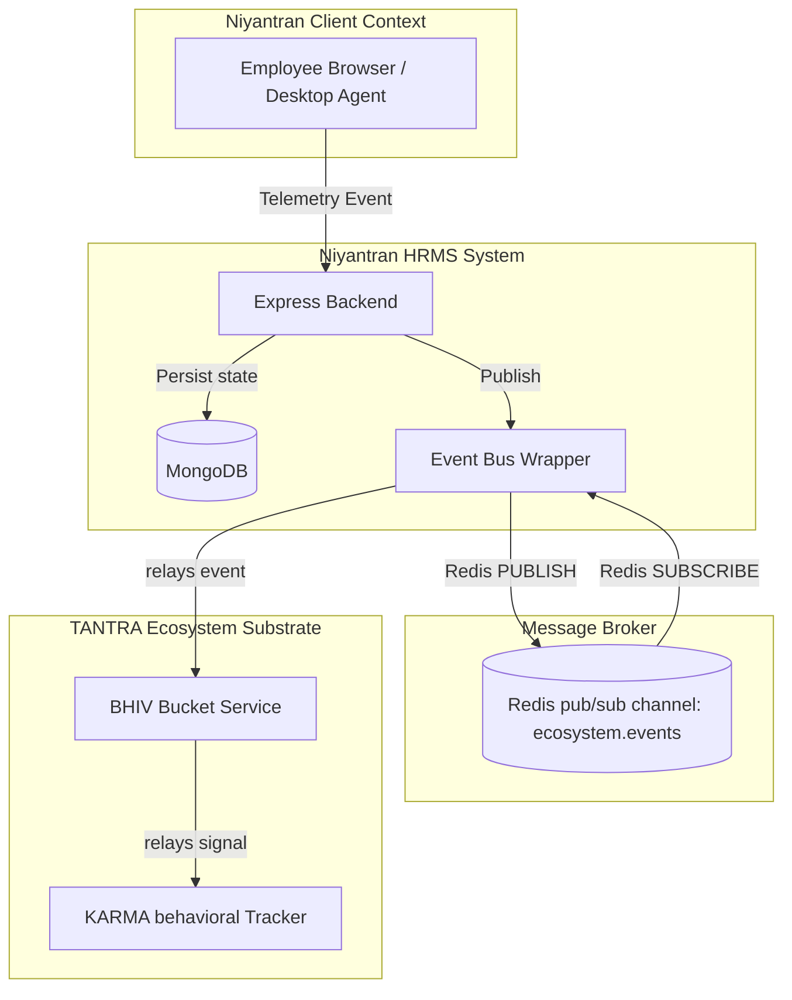
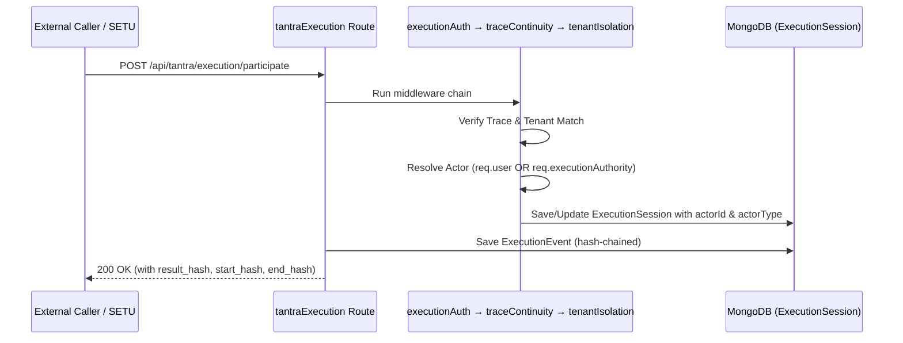

# Architecture Documentation — Niyantran ↔ TANTRA Ecosystem Convergence

**Date:** 2026-07-25  
**Ecosystem Version:** 1.0.0  
**Status:** Completed & Integrated

---

## 1. Architecture Overview

Niyantran operates as an execution participant within the canonical TANTRA ecosystem, adhering to strict boundaries and utilizing shared, decoupled messaging protocols. The integration is split into two primary layers:

1. **TANTRA Gateway Runtime Contracts**: Handles formal execution participation requests, validating routing, tenant isolation, and tracing, and persisting the cryptographic hash chain of event logs.
2. **Decoupled Telemetry Event Bus**: Decouples local behavioral monitoring from downstream ecosystem components (KARMA, Bucket) via a Redis pub/sub event pipeline with graceful local in-process fallback mechanism.



---

## 2. Runtime Sequence Diagrams

### 2.1 Decoupled Telemetry Event Flow (Redis pub/sub)

When telemetry events (e.g. idle duration, site violations, or screenshots) are captured, they are published asynchronously to Redis pub/sub. Decoupled handlers subscribe and dispatch writes to Bucket/KARMA fire-and-forget.

```mermaid
sequenceDiagram
    participant Monitor as Telemetry Monitor (e.g. activityTracker)
    participant Bus as Event Bus (eventBus.js)
    participant Redis as Redis Broker
    participant Handler as eventBus Subscriber
    participant Bucket as Bucket Service

    Monitor->>Bus: publish('excessive_idle', { employeeId, idleMinutes })
    alt Redis is connected
        Bus->>Redis: PUBLISH ecosystem.events
        Redis-->>Handler: On Message ('excessive_idle')
        Handler->>Bucket: storeKarmaEventRecord()
    else Redis is disconnected (Fallback)
        Bus->>Bus: localEmitter.emit('excessive_idle')
        Bus->>Bucket: storeKarmaEventRecord()
    end
    Note over Handler,Bucket: Fire-and-forget; does not block request paths
```

### 2.2 TANTRA Execution Gateway Flow (Trace & Identity Persistence)

For formal execution contracts, the gateway enforces JWT authentication, trace continuity, tenant isolation, and persists the resolved initiating actor details onto the `ExecutionSession` model.


