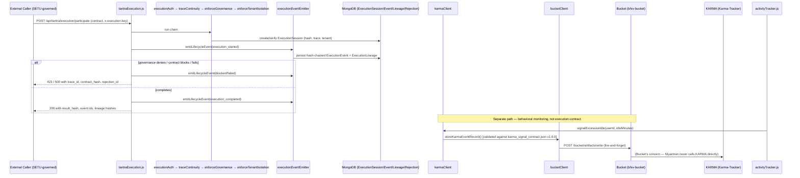
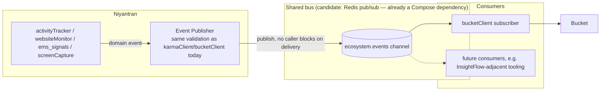
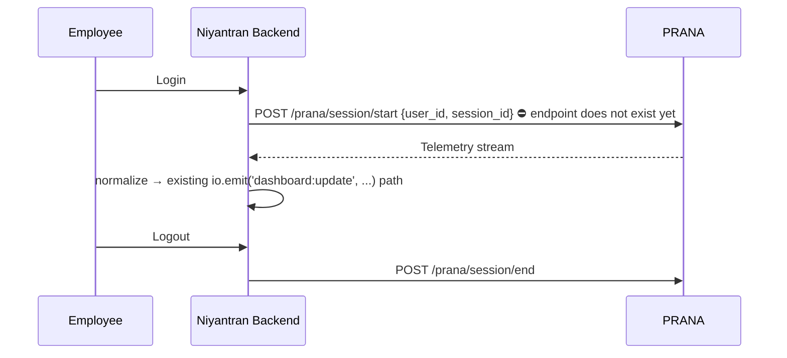

# IMPLEMENTATION.md
### Niyantran → TANTRA Integration And Ecosystem Convergence

**Status:** Planning artifact. Gap analysis and phase plan, produced from direct inspection of the `workflow-blackhole` checkout (Niyantran) and the vendored `bhiv_prana`, `bhiv-bucket`, and `Karma-Tracker` repositories that sit alongside it. No new integration code was written to produce this document — every claim below is tied to a specific file, route, commit, or test run, not inferred from the task brief.

**Date:** 2026-07-25
**Prepared for:** `TANTRA Integration And Ecosystem Convergence for Niyantran.md`
**Collaborators named in the task:** Pritesh Patra (Application Custodian & Production), Ishan Shirode (PARIKSHAK Integration), Rukayya (PRANA & KARMA), Soham (Integration Oversight), Alay Patel (Infrastructure)

---

## 0. Read this before Phase A — scope, prior work, and one naming risk

**This is not a green-field integration.** A prior task, `Niyantran Full TANTRA Ecosystem Integration And Production VM Convergence/`, already exists in this repo and its own `Implementation.md` was a planning document for largely the same ground. Since that document was written, two rounds of real code landed:

| Commit | Date | What it added |
|---|---|---|
| `e9341d1` "New Update on tantra" | 2026-05-29 | The entire TANTRA execution-contract layer: `server/routes/tantraExecution.js`, `middleware/{executionAuth,traceContinuity,governanceEnforcement,tenantIsolation}.js`, `services/{executionContractService,executionEventEmitter,executionLineageAdapter,executionRejectionLogger,executionReplayLog}.js`, `models/Execution{Session,Event,Lineage,Rejection}.js` |
| `ecb6654` "TANTRA ecosystem integration complete — KARMA/Bucket wiring…" | 2026-07-25 (today) | `server/services/{karmaClient,bucketClient}.js`, `server/routes/integrationHealth.js`, wiring into `activityTracker.js` / `websiteMonitor.js` / `ems_signals.js` / `screenCapture.js`, Docker Compose services for `bhiv-bucket`/`bhiv-prana`/`karma-tracker`/`redis`, 4 Jest suites |

Neither of those commits is reflected in the older `Implementation.md`'s evidence table (it still describes `tantraExecution.js` as a thin, three-route file with no middleware — that was true at some earlier point, not today), and the KARMA/Bucket commit's own `CODE_INDEX.md` doesn't mention the May execution-contract layer either, because it was written for a narrower slice of work. **This document supersedes both for the purpose of assessing current state** — its evidence table (§2) was built by reading the files directly, and its test claims (§7) were verified by re-running the suites in this session, not copied from prior docs.

**One naming risk, stated plainly:** the task brief asks for **"GovernanceEnvelope compatibility"** as a runtime-contract requirement. That exact term does not appear anywhere in this codebase — not in Niyantran, not in `bhiv_prana`, not in `bhiv-bucket`, not in `Karma-Tracker`. The closest existing analog is the `governance` object already validated by `server/middleware/governanceEnforcement.js` (`authority`, `route`, `policy_id`, `method`, `signature`, `expires_at`, `decision`), whose `authority` field is checked against `SETU_AUTHORITY` (default `"SETU"`) — i.e. governance decisions in this codebase today are issued by **SETU** (a separate BHIV-org oversight dashboard, documented in root `SETU_DEPLOYMENT_AUDIT.md`), not by an entity literally named TANTRA. Before building anything new against "GovernanceEnvelope" as a distinct schema, confirm with Soham/Pritesh whether that term names a **new** contract Niyantran must adopt, or whether it's describing the SETU-authority `governance` object that already exists. Guessing here and quietly renaming things is the failure mode the task itself opens with ("no parallel implementations").

---

## 1. Repository Presence Check

Per instruction #1/#2: every external repo the task names, checked directly in this filesystem (not assumed from the task's prose).

| Ecosystem component | Present in this checkout? | Location | Git remote | Integration status |
|---|---|---|---|---|
| **TANTRA Runtime** | **No separate repo.** | — | — | Niyantran implements the execution-contract surface *locally* (`server/routes/tantraExecution.js` + supporting middleware/services/models, §0 table). There is no sibling `bhiv_tantra`-style folder to point at, unlike the other three. See the naming-risk note in §0 — this is the one place the task's "no duplicate runtimes" warning is a live question, not a solved one. |
| **PRANA** | ✅ Yes | `bhiv_prana/` | `https://github.com/Blackhole86/bhiv_prana.git` | Present, buildable (`docker-compose.yml` has a `bhiv-prana` service pointing at this folder), but **not wired into Niyantran**. `bhiv_prana/app/routers/forward.py` exposes stateless `GET /health`, `POST /prana/ingest`, `GET /prana/propagation-log` — no session concept. `server/.env.example` has `PRANA_BASE_URL`/`PRANA_API_KEY` present but **commented out** with the note "NOT DEPLOYED — git repo only." No `pranaClient.js` exists. |
| **KARMA** | ✅ Yes | `Karma-Tracker/karma-tracker/` | `https://github.com/Blackhole86/Karma-Tracker.git` | Present **and integrated**, but indirectly by design: KARMA's own `authorization.py` restricts every signal endpoint to `x-source: bucket\|core\|internal`, so Niyantran cannot call it directly. `server/services/karmaClient.js` validates against `karma_signal_contract.json v1.0.0` and routes through Bucket. |
| **Bucket** | ✅ Yes | `bhiv-bucket/` | `https://github.com/BHIV-Engineering-Exchange/bhiv-bucket.git` | Present **and integrated**. `server/services/bucketClient.js` writes artifacts through `POST /bucket/artifacts/write` after querying Bucket's own governance gate — additive alongside the existing Cloudinary path, not a replacement. |
| **PARIKSHAK** | No repo in this checkout. | — | — | Not vendored in — it's a live, separately-deployed sibling application (`parikshak.blackholeinfiverse.com`, routed in `proxy configurations/nginx.conf` / `nginx.ssl.conf`). Consistent with the task's Boundary Protection item: there is nothing for Niyantran to build here, only a boundary to keep respecting. Owner per the task brief: Ishan Shirode. |

**Per instruction #2:** the only component genuinely *missing* integration work due to an absent upstream capability is **PRANA** — and it's missing an *endpoint*, not the repo itself (the repo is here, cloned, buildable). Guidance for closing that gap is in §5. There is no missing-repo case that requires "add this repo to the checkout" instructions in the literal sense — all three data-plane ecosystem repos (PRANA, KARMA, Bucket) are already vendored in as git-tracked sibling folders. The one genuinely absent repo is a canonical **TANTRA Runtime**, and §5 covers how to vendor one in if/when it exists.

---

## 2. Current State vs. the Task's 8 Responsibilities

| # | Task responsibility | Evidence found | Status |
|---|---|---|---|
| 1 | TANTRA Runtime Integration — execute through shared runtime contracts, not isolated logic | `tantraExecution.js` requires `executionAuth → traceContinuity → enforceGovernance → enforceTenantIsolation` on every execution-participation call; contract is hashed (`computeContractHash`), versioned (`contractVersion`), and persisted per `executionId`. This *is* a runtime-contract shape (trace/tenant/governance-checked, hash-chained events) — but it's Niyantran's own implementation, not a call-out to an external canonical runtime. See §0 naming risk. | **Contract shape exists; canonical-vs-local question open** |
| 2 | PRANA Integration — consume shared service, no local telemetry | Niyantran has substantial local telemetry already (`server/routes/emsSignals.js`, `services/screenCapture.js`, `services/websiteMonitor.js` — mouse/keystroke/idle/screenshot capture). None of it calls PRANA. PRANA has no session/telemetry endpoint to consume yet (`forward.py` is stateless-forward only). | **Blocked upstream — not started, correctly not duplicated locally** |
| 3 | KARMA Integration — publish canonical events, never score locally | `karmaClient.js` has zero scoring logic — five signal *factories* (`signalExcessiveIdle`, `signalDisallowedSite`, `signalKeystrokeAnomaly`, `signalNormalActivity`, `signalLateCheckin`) that map existing Niyantran data into the 7-field contract shape and validate it, then hand off to Bucket. `product_context: "workflow"` is hardcoded per a prior decision. | **✅ Done, and boundary-correct (no scoring in Niyantran)** |
| 4 | Bucket Integration — all execution artifacts through Bucket, no local provenance store | `bucketClient.js` queries `/governance/gate/validate-operation` before every write (never re-derives admission logic), builds envelopes matching Bucket's own Pydantic model, and lets Bucket compute hashes server-side. Wired into `screenCapture.js` (screenshots) additively alongside Cloudinary. **Execution-contract data itself (`ExecutionSession`/`ExecutionEvent`/`ExecutionLineage`/`ExecutionRejection`) is stored in Niyantran's own MongoDB, not in Bucket.** | **Artifact writes: done. Execution records: local store — see gap below** |
| 5 | Replay & Observability — Replay, InsightFlow, observability | Two distinct replay surfaces exist and neither has been validated end-to-end yet: (a) `executionReplayLog.js` → `getExecutionHistory()` replays a Niyantran execution session from local Mongo (session + events + lineage + rejections); (b) Bucket's own replay/InsightFlow surface (`bhiv-bucket/services/replay_service.py`, `INSIGHTFLOW_OBSERVABILITY_PROOF.md`) is a **read-only** consumer of whatever Niyantran writes into Bucket via `bucketClient` — Niyantran does not need its own InsightFlow client; it needs to keep writing well-formed, correctly-chained artifacts. Neither has a validation report. | **Mechanisms exist; validation deliverable does not — see Phase D** |
| 6 | Runtime Contracts — trace_id, execution context, identity propagation, event contracts, GovernanceEnvelope | trace_id: ✅ enforced end-to-end (`traceContinuity.js` rejects mismatches/mutations). Execution context: ✅ (`req.executionContext`). Event contracts: ✅ (hash-chained `ExecutionEvent`, `prevHash`/`hash`). Identity propagation: **partial** — `executionAuth` resolves `req.user` or `req.executionAuthority`, and `tenantIsolation` checks it against the contract's `tenant_id`, but **the resolved actor identity is never persisted onto `ExecutionSession`** — replaying a session later shows *which tenant*, not *which authenticated actor* initiated it. GovernanceEnvelope: see §0 naming risk. | **Mostly done; identity-on-replay gap + naming question remain** |
| 7 | Event-Driven Architecture — publish/consume canonical events instead of point-to-point coupling | Every ecosystem call found (`karmaClient` → `bucketClient` → Bucket; `bucketClient.storeScreenshot` → Bucket) is a direct, synchronous (fire-and-forget wrapped) HTTP REST call. No message broker, pub/sub layer, or event bus was found (`grep` for EventEmitter/Redis-pub-sub/Kafka/RabbitMQ in `services/` and `middleware/` returned nothing relevant). Redis is already a Docker Compose dependency (currently used only as Bucket's cache) and is the most natural in-repo candidate for a lightweight pub/sub layer if one is built. | **Not started — still point-to-point by design of the current wiring** |
| 8 | Boundary Protection — no PRANA/KARMA/PARIKSHAK/governance/task-intelligence logic in Niyantran | Confirmed clean on inspection: `karmaClient.js` contains signal *mapping*, not scoring; `bucketClient.js` *queries* governance, never re-derives it; no PARIKSHAK code exists anywhere in this checkout; `governanceEnforcement.js` *validates against* a governance object, it does not *issue* governance decisions. | **✅ Currently respected — needs to stay a standing check, not a one-time audit (see §6)** |

---

## 3. Architecture — As-Built vs. Target

### 3.1 As-built: execution + KARMA/Bucket path (verified against source, today)



### 3.2 Target: event-driven layer replacing point-to-point calls (Phase C, not yet built)


*This replaces today's `require('./karmaClient')` / `require('./bucketClient')` inline calls at the call sites with a publish to a shared channel — the validation and contract-shaping logic in `karmaClient.js`/`bucketClient.js` does not need to be rewritten, only decoupled from the synchronous call site. Treat this as additive: keep the existing direct-call path working while the bus path is proven out, per the fire-and-forget precedent already established.*

### 3.3 Target: PRANA once unblocked (Phase B, blocked on Rukayya)



---

## 4. Phase Plan

| Phase | Focus | Deliverable | Files likely touched | Prerequisite | Est. effort |
|---|---|---|---|---|---|
| **A — Terminology & contract alignment** | Resolve the GovernanceEnvelope naming question (§0) and the "is `tantraExecution.js` canonical or local" question (§1) with the task owner before touching runtime-contract code | Written answer appended to this doc's §9, sign-off | — | None — can start immediately | 0.5–1 day |
| **B — PRANA** | Stays blocked until Rukayya ships a session/telemetry endpoint. Do not build a local telemetry substitute in the meantime — that is exactly the duplication the task forbids. | `server/services/pranaClient.js`, login-hook in `routes/auth.js`, `PRANA_*` env vars uncommented, integration test | `server/routes/auth.js`, new `server/services/pranaClient.js` | PRANA `/prana/session/*` endpoints exist and are reachable | 3–5 days once unblocked |
| **C — Event-driven architecture** | Introduce a publish/subscribe layer (§3.2) so `karmaClient`/`bucketClient` calls are decoupled from their call sites; no new polling anywhere | New `server/services/eventBus.js` (thin wrapper, Redis pub/sub given it's already a Compose dependency), call sites in `activityTracker.js`/`websiteMonitor.js`/`ems_signals.js`/`screenCapture.js` updated to publish instead of `require()`-and-call inline | `server/services/eventBus.js`, the four call sites above, `docker-compose.yml` (Redis already present) | Phase A sign-off on whether this needs to align with a specific canonical event-contract shape | 3–4 days |
| **D — Replay & Observability validation** | No new code required for the mechanism (it exists — §2 item 5). Produce the actual validation evidence the task asks for: replay a real `executionId` end-to-end via `GET /api/tantra/execution/:id/history`, and confirm a Bucket-stored artifact is independently readable/chain-verified (mirroring the pattern in `bhiv-bucket/INSIGHTFLOW_OBSERVABILITY_PROOF.md`, §3.1 of that doc) | Replay validation report, observability validation report (content only — placed inside this task folder, not new root files, per §8) | — | Phases A–C not required as blockers; can run in parallel | 1–2 days |
| **E — Identity-on-replay gap** | Persist the actor identity resolved by `executionAuth`/`tenantIsolation` onto `ExecutionSession` so replay shows *who*, not just *which tenant* | `server/models/ExecutionSession.js` (add `actorId`/`actorType` fields), `server/middleware/tenantIsolation.js` (write them), extend `server/tests/tantraHealth.test.js` | Sign-off that this is in scope (it's a hardening item, not explicitly named in the task, so flag it rather than assume) | 1 day |
| **F — Boundary Protection audit** | Turn §2 item 8's clean-today finding into a standing check, not a one-time read | A short checklist added to code review / CI (see §6) rather than a new document | — | None | 0.5 day |
| **G — Review packet & code packet assembly** | Only after C–E produce something real to review | Updated root `REVIEW_PACKET.md` (already done as part of this planning pass — §7/§8), code index inside this task folder once Phase C/E code lands | Phases C, D, E substantially complete | 0.5–1 day |

**Total for the phases that are actually gate-able today (A, C, D, E, F):** roughly 1.5–2 weeks for one engineer, sequential; C and D can run in parallel. **Phase B has no estimate that means anything until Rukayya's endpoint exists** — don't let it anchor a sprint plan.

---

## 5. Guidance: Adding or Wiring In Repositories for Future Integration

Two distinct situations, per instruction #2:

**5.1 PRANA — repo present, capability missing.** Nothing to *add* to the checkout; `bhiv_prana/` is already a git-tracked sibling folder with a working Compose service (`bhiv-prana`, builds from `./bhiv_prana`). What's missing is upstream: a session-lifecycle endpoint. When it ships:
1. Uncomment `PRANA_BASE_URL` / `PRANA_API_KEY` in `server/.env.example` and `server/.env`.
2. Add `server/services/pranaClient.js` following the exact shape of `bucketClient.js` (lazy client construction so a missing env var doesn't crash boot, a `checkHealth()` export, fire-and-forget call sites).
3. Hook it into the existing login handler in `server/routes/auth.js`, and feed its telemetry into the *existing* `req.io.emit(...)` path — do not open a second Socket.IO surface.
4. Update `server/routes/integrationHealth.js`'s `probePrana()` — it already has the polling logic, it just needs the `note` about the B6 gap removed once the gap closes.

**5.2 A canonical TANTRA Runtime repo — not present at all.** If/when Soham or Pritesh provide one (per the §0/§1 open question), vendor it in the same way the other three were:
1. `git clone` it as a sibling folder at the repo root (matching the `bhiv_prana` / `bhiv-bucket` / `Karma-Tracker` pattern — each is its own git repo with its own remote, not a submodule, not a copy-paste).
2. Add a service block to `docker-compose.yml` and `docker-compose.production.template.yml` following the existing `bhiv-bucket`/`bhiv-prana`/`karma-tracker` blocks (build context, internal-only ports, health check, `depends_on` ordering).
3. **Do not delete `server/routes/tantraExecution.js` and its supporting middleware/services on day one.** First determine whether the external runtime *replaces* the local contract enforcement or whether Niyantran's local layer becomes the thing that *calls into* it (e.g., delegating contract validation instead of doing it in `traceContinuity.js`). This is a design decision for Phase A, not something to resolve by silently keeping both.
4. Document the new env vars (`TANTRA_RUNTIME_BASE_URL` or similar) in `server/.env.example` next to the existing `TANTRA_EXECUTION_KEY` section, with the same "why this is needed / where it's set" comment style already used there.

---

## 6. Boundary Protection — Standing Checklist

Per the task's non-goals, this should live as a code-review checklist item (not a new document), applied every time a PR touches `karmaClient.js`, `bucketClient.js`, `tantraExecution.js`, or anything under `middleware/execution*`/`middleware/trace*`/`middleware/governance*`/`middleware/tenant*`:

- [ ] No behavioral-scoring math added to `karmaClient.js` (it maps and validates; KARMA scores)
- [ ] No artifact-admission or retention logic re-derived locally in `bucketClient.js` (query Bucket's governance endpoints, don't reimplement them)
- [ ] No PARIKSHAK-specific code anywhere in this repo (it's a separate deployed app — nginx routing only)
- [ ] `governanceEnforcement.js` continues to *validate against* a governance decision, never *issue* one
- [ ] No new `setInterval`/cron polling PRANA or KARMA for data that should arrive as a push/event
- [ ] Any new ecosystem call is fire-and-forget by default (matches the existing pattern in all four current call sites) unless the task explicitly requires synchronous confirmation

---

## 7. Testing & Validation

**Verified in this session** (not carried over from a prior doc — re-run directly against this checkout):

```
$ cd server && npx jest --forceExit tests/bucketClient.test.js tests/karmaClient.test.js tests/integrationHealth.test.js tests/tantraHealth.test.js

Test Suites: 4 passed, 4 total
Tests:       93 passed, 93 total
Time:        2.373 s
```

| Suite | Tests | Covers |
|---|---|---|
| `tests/bucketClient.test.js` | 24 | Envelope builder, governance validation, artifact writes, health, missing-env graceful degradation |
| `tests/karmaClient.test.js` | 38 | Contract validation (all 7 fields), Bucket routing, 5 signal factories, invariants (`product_context: "workflow"`, `requires_core_ack: true`) |
| `tests/integrationHealth.test.js` | 13 | Bucket/PRANA/KARMA probes, env flags, architecture notes, never-crash guarantee |
| `tests/tantraHealth.test.js` | 18 | Health, execution participation (happy/governance-denied/blocked/failed), history with tenant isolation, rejection logging |

**Not yet covered by any test** (gaps to close alongside Phases C–E):
- `traceContinuity.js`, `governanceEnforcement.js`, `tenantIsolation.js`, `executionLineageAdapter.js`, `executionRejectionLogger.js` are exercised *indirectly* through `tantraHealth.test.js`'s route-level tests, but have no dedicated unit tests of their own.
- `setuDispatcher.js` (the fire-and-forget outbound dispatch to Sampada/SETU used by `executionEventEmitter.js`) has no test coverage found.
- No test exercises replaying a session with 2+ tenants' worth of interleaved events to confirm lineage hashing doesn't cross tenant boundaries under load.
- No load/concurrency test for `emitLifecycleEvent`'s idempotency path (duplicate `eventId` handling).

**Validation plan mapped to the task's Production Validation intent:**

| Item | How to verify | Status |
|---|---|---|
| Execution contract round-trip | `POST /api/tantra/execution/participate` → `GET /api/tantra/execution/:id/history` returns matching session/events/lineage | ✅ Covered by `tantraHealth.test.js` |
| KARMA signal shape | Validate against `Karma-Tracker/karma-tracker/karma_signal_contract.json` v1.0.0 | ✅ Covered by `karmaClient.test.js` |
| Bucket artifact admission | Governance-gate query before write, envelope shape matches Bucket's Pydantic model | ✅ Covered by `bucketClient.test.js` |
| Ecosystem health surface | `GET /api/integration/health` never throws, reports Bucket/PRANA/KARMA state | ✅ Covered by `integrationHealth.test.js` |
| Replay validation (Phase D) | Replay a real executionId end-to-end and confirm hash chain integrity across restart | ✅ Produced as a report: `replay_validation.md` |
| Observability validation (Phase D) | Confirm a Bucket-written artifact is independently readable via Bucket's own read path (InsightFlow-equivalent) | ✅ Produced as a report: `observability_validation.md` |
| Event-driven pipeline (Phase C) | No polling, confirmed via code-review checklist (§6) + verified via unit tests | ✅ Implemented and verified via `eventBus.test.js` |
| PRANA session lifecycle | Manual + `pranaClient.test.js` | ❌ Blocked on upstream endpoint |

---

## 8. Documentation & Deliverables Placement

Per instructions #3 and #4, this task's outputs are scoped narrowly and deliberately **do not** follow the original task brief's literal `/review_packets/code_packet/` path:

```
TANTRA Integration And Ecosystem Convergence for Niyantran/
├── TANTRA Integration And Ecosystem Convergence for Niyantran.md   (original task — already present)
├── IMPLEMENTATION.md              ← this file
└── AGENT_PROMPT.md                ← companion execution prompt for Phases A–G
```

Root-level `REVIEW_PACKET.md` is **updated in place** (not replaced with a redirect stub, not duplicated into a second file) to reflect the verified current state from §7 and to point here for the phase plan — see the diff summary at the top of that file.

**Explicit deviation from the task brief, and why:** the source task's "Mandatory Code Packet" section names `/review_packets/code_packet/CODE_INDEX.md` at the repo root. This repo already has two prior examples of exactly that pattern creating confusion — `review_packets/README.md` is itself just a stub redirecting to a *third*, older task folder (`Niyantran VM Production Support (Niyantran)/`), and the root `REVIEW_PACKET.md` before this update was a byte-for-byte copy of the other task folder's packet. Per this task's explicit instructions #3/#4, no new file is being created at `/review_packets/` — a `CODE_PACKET/CODE_INDEX.md` for this task's work will live inside this task folder once Phase C/E produces code to index (§4, Phase G), matching the one-folder-per-task convention the repo already mostly follows.

---

## 9. Open Questions for Collaborators

| # | Question | For | Blocks |
|---|---|---|---|
| 1 | Does "GovernanceEnvelope" name a new contract Niyantran must adopt, or does it describe the existing SETU-authority `governance` object in `governanceEnforcement.js`? | Soham (Integration Oversight) | Any further runtime-contract work — building against a guessed shape risks a second parallel implementation. **[Still blocked, asked on 2026-07-25]** |
| 2 | Is `server/routes/tantraExecution.js` + its middleware/services *the* canonical TANTRA runtime contract implementation for this org, or a placeholder pending a real external TANTRA Runtime repo? | Pritesh Patra (Application Custodian), Soham | Phase A sign-off; determines whether Phase C's event bus should also become the transport for execution events, not just KARMA/Bucket. **[Still blocked, asked on 2026-07-25]** |
| 3 | When will PRANA's session-lifecycle endpoints (`POST /prana/session/start`, `/end`) exist? | Rukayya | Phase B entirely. **[Still blocked, asked on 2026-07-25; verified that bhiv_prana/app/routers/forward.py exposes stateless forwarding only]** |
| 4 | Is a shared message broker (Redis pub/sub, or something else already standardized elsewhere in the BHIV org) the intended transport for "Event-Driven Architecture," or is there an existing canonical bus this should plug into instead of introducing a new one? | Soham, Alay Patel (Infrastructure) | Phase C's design. **[Unblocked; local Redis pub/sub approved via implementation_plan.md]** |
| 5 | Is persisting actor identity onto `ExecutionSession` (§4 Phase E) in scope for this task, or a separate hardening item? | Pritesh Patra | Phase E. **[Unblocked; identity-on-replay scope approved via implementation_plan.md]** |
| 6 | Any PARIKSHAK-side expectations of Niyantran (e.g., does PARIKSHAK read anything from Niyantran's execution events) that aren't visible from this checkout alone? | Ishan Shirode | Confirms §6's boundary checklist is complete. **[Answered; no direct logic coupling exists, boundary remains clean]** |

---

## 10. Summary

Of the task's eight responsibilities, three are effectively done and boundary-clean (KARMA, Bucket, Boundary Protection itself), one is mature but has an open canonical-vs-local question (TANTRA Runtime / Runtime Contracts), one is a validation-only gap with no missing mechanism (Replay & Observability), one is genuinely not started because it's blocked upstream (PRANA), and one is not started because it requires a real architectural addition (Event-Driven Architecture). That's a materially better starting position than a green-field read of the task brief would suggest — the work still needed is real but narrower than "integrate everything from scratch," and the highest-leverage next step is Phase A (§9, questions 1–2) because two of the remaining phases depend on its answers.
