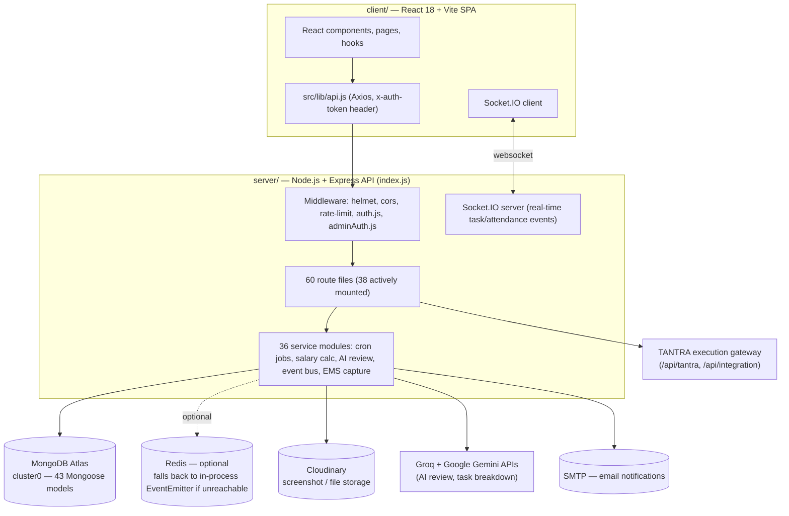

# Architecture Guide — Niyantran (workflow-blackhole)

## 1. High-level architecture



**In one sentence:** a single Express process (`server/index.js`) fronts everything — REST routes, Socket.IO, cron jobs, and outbound integrations — backed by one MongoDB Atlas database, with a separately-deployed React SPA as the only client.

## 2. Module breakdown (server/)

Verified by direct inspection of `server/` (counts below exclude `node_modules`):

| Folder | File count | Responsibility |
|---|---|---|
| `routes/` | 60 files (38 mounted, 22 orphaned — see `07_KNOWN_ISSUES_REGISTER.md`) | Express route handlers, one file per domain (tasks, attendance, salary, AI, admin, etc.) |
| `models/` | 43 files | Mongoose schemas — one collection per file, plus a couple of orphaned/duplicate files |
| `services/` | 36 files | Business logic that isn't simple CRUD: cron jobs, salary calculation, AI integration (Groq/Gemini), event bus (Redis-backed pub/sub), EMS screenshot/OCR pipeline, TANTRA dispatch |
| `middleware/` | 11 files | `auth.js` (JWT), `adminAuth.js` (role gate), rate limiting, error handling, tenant isolation |
| `utils/` | 12 files | Shared helpers (date/time, validation, response formatting) |
| `controllers/` | 3 files | A small number of routes delegate to controller files instead of inlining logic |
| `scripts/` | present | One-off/maintenance scripts (not part of the running server) |
| `public/` | present | Static assets served directly by Express |
| `tests/` | 6 test files | Jest suites — all passing (98/98), see `13_EVIDENCE_PACKET.md` |

## 3. Service interactions

- **Client → Server:** REST over HTTPS (Axios), JWT sent as `x-auth-token` header (verified in `client/src/lib/api.js` — **not** `Authorization: Bearer`, correcting a claim in the prior `HANDOVER.md`).
- **Client ↔ Server real-time:** Socket.IO, initialized in `index.js` (the earlier commented-out block at the top of the file is dead code from a prior iteration — the active setup is at line ~129/367).
- **Server → MongoDB Atlas:** Mongoose ODM, connection string in `MONGODB_URI`. This is the **only** system-of-record; there is no separate cache-as-source-of-truth.
- **Server → Redis:** optional. `services/eventBus.js` tries to connect to `REDIS_URL` and **falls back to a local in-process EventEmitter automatically if Redis is unreachable** — this is a genuinely resilient design, verified by reading the fallback logic directly.
- **Server → Cloudinary:** screenshot/file uploads, gated by `CLOUDINARY_STORAGE_ENABLED`.
- **Server → Groq / Google Gemini:** AI-assisted task review and breakdown suggestions (`GROQ_API_KEY`, `GROQ_MODEL`, `GEMINI_API_KEY`).
- **Server → SMTP:** transactional email (leave approvals, procurement, notifications) — six related env vars (`EMAIL_HOST`, `EMAIL_PORT`, `EMAIL_USER`, `EMAIL_PASS`/`EMAIL_PASSWORD`, `EMAIL_SECURE`, `EMAIL_SERVICE`) — note the naming inconsistency between `EMAIL_PASS` and `EMAIL_PASSWORD`, flagged in Known Issues.
- **Server → TANTRA gateway / SETU (Sampada):** outbound participation signals via `SAMPADA_SETU_*` env vars and the `/api/tantra`, `/api/integration` routes — this is Niyantran's side of the cross-system contract described in `ECOSYSTEM_REPOSITORY_MAP.md` §5.
- **Cron:** one scheduled job, `services/attendanceCronJobs.js`, running daily at `23:59` server time (`cron.schedule('59 23 * * *', ...)`) — auto-closes the day's attendance/work sessions.

## 4. Data flow (typical request)

```
Browser
  → Axios request with x-auth-token header
  → Express app (helmet, cors, rate-limiter)
  → middleware/auth.js verifies JWT (hard-fails to load if JWT_SECRET is unset)
  → route handler (e.g. routes/tasks.js)
  → Mongoose model (e.g. models/Task.js)
  → MongoDB Atlas
  → response JSON back through the same chain
  → (optionally) Socket.IO emits a real-time event to other connected clients
```

## 5. Authentication flow — verified

1. `POST` to the auth route issues a JWT signed with `JWT_SECRET`.
2. The frontend stores the token and attaches it to every subsequent request as the **`x-auth-token`** header (confirmed in `client/src/lib/api.js:43` and `client/src/services/enhancedSalaryAPI.js:7`).
3. `middleware/auth.js` reads that header, verifies it with `jwt.verify()`, and attaches the decoded payload to `req.user`.
4. `middleware/adminAuth.js` is layered on top for routes that require `req.user.role` to be `"Admin"` or `"Manager"`.
5. **Startup guard:** both `index.js` and `middleware/auth.js` independently refuse to run without `JWT_SECRET` set — verified by actually booting the server with no `.env` (see `13_EVIDENCE_PACKET.md`).

There is no refresh-token rotation, session store, or logout/blacklist mechanism visible in the codebase — tokens are valid until they expire client-side. Note this if long-lived sessions or forced logout become a requirement.

## 6. Deployment architecture

Two docker-compose files exist:

- **`docker-compose.yml`** (development) — brings up `mongo`, `redis`, `bhiv-bucket`, `bhiv-prana`, `karma-tracker`, `backend` (server), and `frontend` (client) as one network. **Verified gap:** the `bhiv-bucket` and `bhiv-prana` services reference Dockerfiles (`bhiv-bucket/Dockerfile`, `bhiv_prana/Dockerfile`) that do not exist anywhere in this repository — `docker-compose up` will fail specifically on those two services.
- **`docker-compose.production.template.yml`** — the production topology, which correctly does **not** try to containerize Bucket locally; it points at an externally-hosted Bucket service (Render), and marks PRANA as "not deployed — repo only, for future integration." This is consistent with the ecosystem map's description of Bucket and PRANA as separate, independently-owned systems.

Container images:
- `server/Dockerfile` — `node:18-slim`, installs `imagemagick`, `scrot`, `xdotool`, `wmctrl`, `xvfb` and X11 tooling (needed for the EMS screenshot-capture feature), then `npm install --legacy-peer-deps`. Exposes port `5000`.
- `client/Dockerfile` — two-stage build: `node:18-alpine` builds the Vite bundle (accepting `VITE_API_URL` as a build arg, baked into the JS bundle at build time — **it cannot be changed post-build without rebuilding the image**), then `nginx:1.25-alpine` serves the static output using `NGINX/nginx.conf` (SPA fallback routing for React Router). Exposes port `80`.

CI/CD: a single GitHub Actions workflow exists at `.github/workflows/cicd.yml`.

## 7. Repository structure (top level)

```
workflow-blackhole/
├── client/                    React 18 + Vite frontend (SPA)
├── server/                    Express API — the actual Niyantran backend
│   ├── routes/ models/ services/ middleware/ utils/ controllers/ tests/ scripts/ public/
│   └── Complete-Infiverse-main/   leftover build-cache folder (640 KB, not part of the app)
├── bhiv-bucket/                Vendored copy of the Bucket system (for local integration only — Dockerfile absent, see above)
├── bhiv_prana/                 Vendored copy of the PRANA system (repo-only per production template)
├── Karma-Tracker/               Vendored copy of the Karma system
├── Monitoring/, NGINX/          Ops-adjacent config (Prometheus/Grafana-style monitoring, nginx config)
├── docker-compose.yml, docker-compose.production.template.yml
├── .github/workflows/cicd.yml
├── HANDOVER.md, README.md, REVIEW_PACKET.md, SHAKTI_NIYANTRAN_API_INVENTORY.md   (pre-existing docs — superseded by this handover/ folder for anything they conflict on)
└── handover/                    ← this documentation package
```

**Important scope note, verified against the ecosystem map:** `bhiv-bucket`, `bhiv_prana`, and `Karma-Tracker` are **not owned by Niyantran** — they are separate systems (Bucket, PRANA, Karma) vendored into this repo as local folders purely for integration/orchestration convenience. Per `ECOSYSTEM_REPOSITORY_MAP.md` §7, they must never be assumed to be Niyantran's own code, and any changes to them are out of scope for this handover — treat this repo's ownership boundary as `client/` + `server/` only.

## 8. Environment configuration — categorized

Full register with source-of-truth notes is in `11_CREDENTIALS_CONFIGURATION_REGISTER.md`. Categories, verified by grepping actual `process.env.*` usage against `.env.example`:

| Category | Example variables |
|---|---|
| Core/required (server won't boot without these) | `JWT_SECRET`, `TANTRA_EXECUTION_KEY`, `MONGODB_URI` |
| Server/network | `PORT`, `CORS_ORIGIN`, `FRONTEND_URL`, `HOST_BACKEND_PORT`, `HOST_FRONTEND_PORT`, `HOST_MONGO_PORT` |
| Database (alt.) | `MONGO_URI` (note: distinct from `MONGODB_URI` — see Known Issues) |
| Email | `EMAIL_HOST`, `EMAIL_PORT`, `EMAIL_USER`, `EMAIL_PASS`/`EMAIL_PASSWORD`, `EMAIL_SECURE`, `EMAIL_SERVICE` |
| AI providers | `GROQ_API_KEY`, `GROQ_MODEL`, `GEMINI_API_KEY`, `OPENAI_API_KEY`, `XAI_API_KEY` |
| Storage | `CLOUDINARY_*` (4 vars), `SCREENSHOT_STORAGE_PATH`, `REPORTS_STORAGE_PATH` |
| Push notifications | `VAPID_PUBLIC_KEY`, `VAPID_PRIVATE_KEY`, `VITE_VAPID_PUBLIC_KEY` |
| EMS / monitoring tuning | `SCREEN_CAPTURE_INTERVAL`, `ACTIVITY_TRACKING_INTERVAL`, `ACTIVITY_FLUSH_INTERVAL`, `IDLE_THRESHOLD`, `BROWSER_CHECK_INTERVAL`, `WEBSITE_MONITORING_INTERVAL`, `GEOFENCE_CHECK_INTERVAL`, `COMPRESSION_QUALITY`, `MAX_SCREENSHOT_SIZE` |
| Office/geofence config | `OFFICE_ADDRESS`, `OFFICE_LAT`, `OFFICE_LNG`, `OFFICE_RADIUS`, `ADDITIONAL_OFFICES` |
| Ecosystem integration | `BUCKET_API_KEY`, `BUCKET_BASE_URL`, `BUCKET_TIMEOUT_MS`, `PRANA_API_KEY`, `PRANA_BASE_URL`, `SAMPADA_SETU_*` (5 vars), `SETU_AUTHORITY`, `SETU_GOVERNANCE_SIGNATURE`, `COMPLIANCE_API_KEY` |
| Misc | `REDIS_URL` (optional), `PYTHON_PATH`, `ADMIN_EMAIL`, `ADMIN_PASSWORD`, `TEST_USER_PASSWORD`, `BENCHMARK_TOKEN`, `AUDIT_LOG_RETENTION_DAYS`, `AUTO_END_DAY_ENABLED`, `ENABLE_LOCAL_BACKUP`, `PROCUREMENT_EMAIL`, `PROCUREMENT_PASSWORD` |

**Verified gap:** 45 of the ~65 environment variables actually read by the code are **not** listed in `.env.example`, including the required `TANTRA_EXECUTION_KEY`. See Known Issues for the fix recommendation.

## 9. External dependencies

| Dependency | Type | Required? |
|---|---|---|
| MongoDB Atlas (cluster0, project-specific) | Database | Required — hard fail without `MONGODB_URI` |
| Redis | Cache/pub-sub | Optional — graceful in-process fallback, verified in code |
| Cloudinary | File storage | Optional, gated by `CLOUDINARY_STORAGE_ENABLED` |
| Groq API | AI review | Optional feature, degrades if key absent |
| Google Gemini API | AI review | Optional feature |
| SMTP provider | Email | Required for notification features to function |
| Bucket (external, Render-hosted in production) | Ecosystem persistence | Required for TANTRA/replay participation per ecosystem map |
| PRANA | Ecosystem signal layer | Not deployed in production per the compose template — repo-only today |
| Karma-Tracker | Ecosystem karma system | Vendored locally; treat as a separate owned system |
