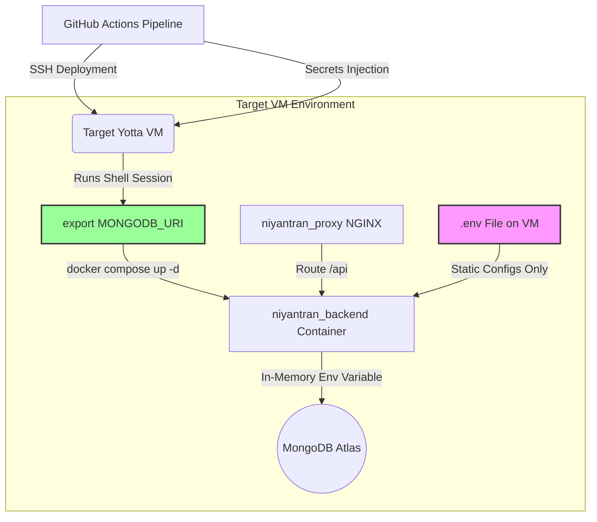

# MongoDB Atlas Secure Connectivity Evaluation & Production Hardening Report
**Target System:** Niyantran VM Infrastructure  
**Author:** Alay Patel (Infrastructure Owner)  
**Stakeholder Alignment:** Shashank

---

## 1. Executive Summary

This report establishes the secure connectivity baseline for linking the live **Niyantran** VM containerized stack with **MongoDB Atlas** (our centralized production database). The core objective is to prevent exposing database credentials (especially the `MONGODB_URI` connection string) on the host filesystem while avoiding the overhead of heavy, complex secrets-management clusters (like HashiCorp Vault) or Swarm/Kubernetes orchestration.

### 🏆 Selected & Implemented Approach: **Option 1 (Runtime Secret Injection via GitHub Actions)**
This solution secures database credentials by keeping the `MONGODB_URI` completely out of static configuration files (like `.env`) on the host VM. Instead, the connection string is injected directly from **GitHub Actions Secrets** into the memory of the VM shell session during deployment and passed to the container runtime via Docker Compose.

---

## 2. Current Infrastructure & Database Architecture

The Niyantran stack operates on a lean, high-leverage virtualized node:
- **Orchestrator:** Docker Compose v2 (running on Ubuntu 22.04 LTS).
- **Ingress Proxy:** NGINX container routing traffic and terminating SSL.
- **Database Backend:** Previously, a local MongoDB database container was run with a persistent volume. This has been deprecated and disabled in production. The system now references the company's live database hosted on **MongoDB Atlas** for centralized access by future BHIV consumers (SETU, PRANA, Live Attendance, etc.).
- **CI/CD Pipeline:** Fully automated deployment via GitHub Actions SSH runners.



> [!IMPORTANT]
> The `.env` file created on the VM during deployment **never** contains the `MONGODB_URI` connection string. It only holds non-sensitive host configurations, VAPID public keys, and other application settings. The URI is injected into the container at startup using shell memory injection.

---

## 3. Evaluation of Connectivity Options

We evaluated four candidate architectures against security, cost, operational overhead, and feasibility for the BHIV infrastructure.

---

### Option 1: Secret Injection at Container Runtime (GitHub Actions)
The deployment pipeline passes the secret directly to the shell and loads it into the container configuration dynamically.

*   **How it works:** 
    1. The production connection string is stored securely in GitHub Secrets as `MONGODB_URI`.
    2. The CI/CD pipeline SSHes to the production VM.
    3. The deployment script exports the variable `MONGODB_URI='${{ secrets.MONGODB_URI }}'` in the temporary SSH session.
    4. The pipeline executes `docker compose -f docker-compose.production.yml up -d`.
    5. Docker Compose reads `${MONGODB_URI}` from the active shell environment and passes it to the `backend` container's environment space.
    6. The SSH session terminates, clearing the environment variable from the host shell.
*   **Security Benefits:** 
    - The connection string is **never** written to any file on the VM's disk.
    - Standard file audits (`cat .env` or `cat docker-compose.production.yml`) will not leak the password.
    - Zero exposure in Git repositories.
*   **Drawbacks:** 
    - If a VM administrator SSHes in manually and runs `docker compose restart backend`, the container will restart successfully using its cached environment metadata. However, if they run `docker compose down && docker compose up -d`, the connection will fail unless they manually set the `MONGODB_URI` variable.
*   **Cost:** ₹0 (leveraging existing GitHub Actions and Docker features).
*   **Operational Complexity:** Low. Integrates directly into the existing shell deployment flow.
*   **BHIV Maintenance Feasibility:** Extremely High. Easily maintainable by any developer with basic Docker Compose experience.

---

### Option 2: External Secret Management Services
Using dedicated secret stores to fetch database keys on startup.

*   **Candidates Evaluated:**
    *   **Docker Secrets:** Natively supported in Docker Swarm/Kubernetes. Under standard Docker Compose, "secrets" are implemented as simple file mounts, meaning the connection string must be saved as a plain text file on the host VM disk, which violates our security requirements.
    *   **HashiCorp Vault:** A massive self-hosted secret server. Highly secure but introduces a "chicken-and-egg" issue (the VM needs a Vault login token to query Vault, which itself must be stored securely on the VM).
    *   **Doppler / Infisical / 1Password Secrets:** SaaS secret managers. They require installing a CLI agent on the VM or inside the container to pull keys from the cloud at container startup.
*   **Security Benefits:** Centralized control, secret auditing, access logs, and easy rotation.
*   **Drawbacks:**
    - Docker Swarm/Kubernetes adds massive complexity (resource overhead >1.5GB RAM).
    - Vault adds heavy operational and maintenance overhead.
    - Doppler/Infisical create an external SaaS dependency. If the provider goes down or internet connectivity is interrupted on the VM, the container cannot start.
*   **Cost:** 
    - Vault: ₹0 software cost, but requires higher VPS resources (+₹1,000/month).
    - Doppler/Infisical: ~₹800 to ₹4,000/month ($10 - $50/month) for team tiers.
*   **Operational Complexity:** High. Requires maintaining agents, SDKs, or dedicated servers.
*   **BHIV Maintenance Feasibility:** Low to Medium. Adds unnecessary moving parts for a lean startup infrastructure.

---

### Option 3: Private Connectivity (VPC Peering & VPNs)
Restricting network connectivity to private channels to ensure MongoDB Atlas is unreachable from the public internet.

*   **How it works:** Establishing an AWS VPC Peer, Azure VNet Peer, or an overlay network (Tailscale/WireGuard) between the Niyantran VM and MongoDB Atlas.
*   **Security Benefits:** Eliminates the public database endpoint completely. Attackers scanning public ports will never find the database, rendering brute-force or injection vector discovery impossible.
*   **Drawbacks:**
    - MongoDB Atlas Private Endpoints (PrivateLink/VPC Peering) are **only** available on dedicated clusters (M10 tier or higher). They are unsupported on shared clusters (M0/M2/M5 tiers).
    - Tailscale/WireGuard agents cannot be run directly on Atlas nodes since it is a fully managed cloud database. Setting this up requires a custom NAT/proxy gateway in the cloud provider's network, adding another virtual machine to manage.
*   **Cost:** 
    - Upgrading Atlas from free/low tier to M10 costs at least **₹5,000/month** (~$60/month).
    - PrivateLink endpoints add another **₹1,200/month** (~$15/month) in cloud network fees.
*   **Operational Complexity:** Extremely High. Requires network route design, DNS configuration, and VPC peering updates.
*   **BHIV Maintenance Feasibility:** Low. Cost-prohibitive and structurally over-engineered for the current scale.

---

### Option 4: Credential Rotation (API-Driven)
Programmatically rotating the database username and password on a schedule.

*   **How it works:** A cron job runs (e.g. weekly in GitHub Actions or on the host) that uses the Atlas Admin API to generate a new database password, updates GitHub Actions Secrets, and triggers a rolling container redeployment.
*   **Security Benefits:** Drastically limits the lifetime of any leaked credentials.
*   **Drawbacks:**
    - Risk of deployment failure or API rate limits breaking the pipeline.
    - Requires writing and maintaining custom API integration scripts.
*   **Cost:** ₹0.
*   **Operational Complexity:** High.
*   **BHIV Maintenance Feasibility:** Medium. Recommended as a future enhancement but not for the initial launch phase.

---

## 4. Architectural Comparison Summary Matrix

| Metric | Option 1: Runtime Secret Injection (Chosen) | Option 2: Secrets Managers (Doppler/Vault) | Option 3: Private Endpoints (PrivateLink) | Option 4: Credential Rotation |
| :--- | :--- | :--- | :--- | :--- |
| **Security Score** | **High** (No disk storage) | **Very High** (Centrally controlled) | **Extreme** (No public IP) | **Very High** (Time-limited) |
| **Hosting/SaaS Cost** | **₹0 / month** | ₹800 – ₹4,000 / month | ₹6,000+ / month | ₹0 / month |
| **Operational Overhead** | **Very Low** | High (Agent maintenance) | Extremely High (VPC config) | High (Script maintenance) |
| **External Dependencies**| **None** (Only GitHub Actions) | SaaS APIs / Vault Clusters | Cloud Provider Routing | Atlas Admin API |
| **BHIV Feasibility** | **100% (Recommended)** | 40% (Too complex/costly) | 20% (Cost-prohibitive) | 60% (Future improvement) |

---

## 5. Engineering Recommendation Rankings

1.  **Recommended (Implemented): Option 1 — Secret Injection at Container Runtime (via GitHub Actions)**
    - *Rationale:* Completely resolves credential storage on the VM disk. It leverages the standard Docker Compose and GitHub Actions stacks already in use, keeping operations simple and maintenance costs at zero.
2.  **Acceptable Alternative: Option 2 — Doppler or Infisical**
    - *Rationale:* Good choice if BHIV moves to multiple servers or requires an enterprise-wide developer credentials portal.
3.  **Acceptable Future Phase: Option 4 — API-Driven Credential Rotation**
    - *Rationale:* Implement once a stable scale is reached to automate key rotation weekly, reducing threat windows.
4.  **Not Recommended: Option 3 — Private Endpoints & VPNs**
    - *Rationale:* Structurally over-engineered and financially unviable due to MongoDB Atlas M10+ pricing requirements.

---

## 6. Implementation Architecture Details

### A. Environment Separation & Configuration
The template composition is defined in [docker-compose.production.template.yml](file:///c:/Users/ASUS/OneDrive/Desktop/BHIV-Tasks/SETU/workflow-blackhole/docker-compose.production.template.yml). The MongoDB container is **commented out** to prevent running local databases in production.

Inside the backend service definition:
```yaml
  backend:
    image: bhiv/niyantran-backend:IMG_TAG
    container_name: niyantran_backend
    restart: unless-stopped
    environment:
      MONGODB_URI: ${MONGODB_URI}
    env_file:
      - .env
```
- `${MONGODB_URI}` maps to the host shell variable.
- `.env` contains other environment files but **excludes** the database connection string.

### B. CI/CD Pipeline Runtime Injection
The [cicd.yml](file:///c:/Users/ASUS/OneDrive/Desktop/BHIV-Tasks/SETU/workflow-blackhole/.github/workflows/cicd.yml) pipeline executes the following step on the remote VM:
```bash
# 1. Substitute the built image SHA into the compose template
sed "s|IMG_TAG|${{ needs.build.outputs.sha_short }}|g" docker-compose.production.template.yml > docker-compose.production.yml

# 2. Inject Atlas Connection URI into active shell memory
export MONGODB_URI='${{ secrets.MONGODB_URI }}'

# 3. Pull and spin up the production stack using Compose
docker compose -f docker-compose.production.yml pull
docker compose -f docker-compose.production.yml up -d --remove-orphans
```

---

## 7. Production Hardening Checklist

To verify that this configuration remains secure in production, use the following checklist:

- [x] **TLS/SSL Encryption:** Database connection string must contain `ssl=true` (or `tls=true`) to encrypt VM-to-Atlas network packets in transit.
- [x] **IP Address Whitelisting:** The MongoDB Atlas access list has been restricted *solely* to the static public IP of the Yotta VM (`163.128.209.18`). All other public connection attempts are blocked by the Atlas firewall.
- [x] **Local File Lockdown:** The `.env` file copied to the VM is locked down.
  - *Linux Command:* `chmod 600 ~/NIYANTRAN/.env && chown root:root ~/NIYANTRAN/.env`
- [x] **Git Isolation:** Both `.env` and `.env.production` files are included in the [.gitignore](file:///c:/Users/ASUS/OneDrive/Desktop/BHIV-Tasks/SETU/workflow-blackhole/.gitignore) file to prevent accidental pushes.
- [x] **Docker Image Cleanliness:** The pipeline executes `docker logout` on the VM immediately after pulling images to remove Docker Hub session keys from the server disk.
- [x] **Docker Container Security:** Public host ports are omitted for the backend, database, node-exporter, and cadvisor containers. The NGINX proxy container is the **only** ingress gateway to the virtual network.
